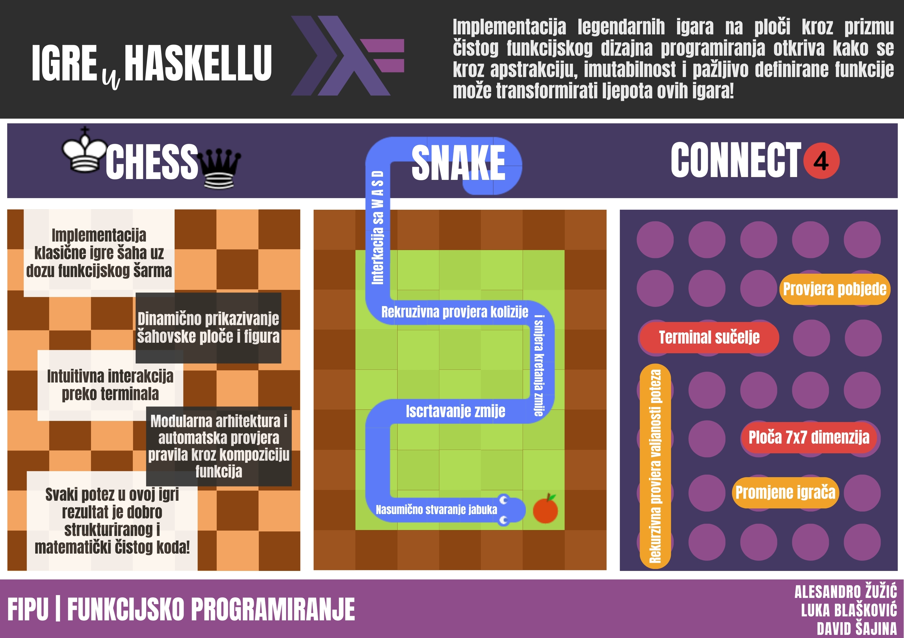

# HaskelLudens

This repository is a showcase of three different games developed in Haskell as a part of the Functional Programming course at the Faculty of Informatics, University of Pula. Each game demonstrates the application of functional programming principles in game development.

## [1. Chess](https://github.com/lukablaskovic/HaskelLudens/tree/main/chess)

- Author: Alesandro Žužić

## [2. Snake](https://github.com/lukablaskovic/HaskelLudens/tree/main/snake)

- Author: Luka Blašković

## [3. Connect 4](https://github.com/lukablaskovic/HaskelLudens/tree/main/connect4)

- Author: David Šajina

### Poster

