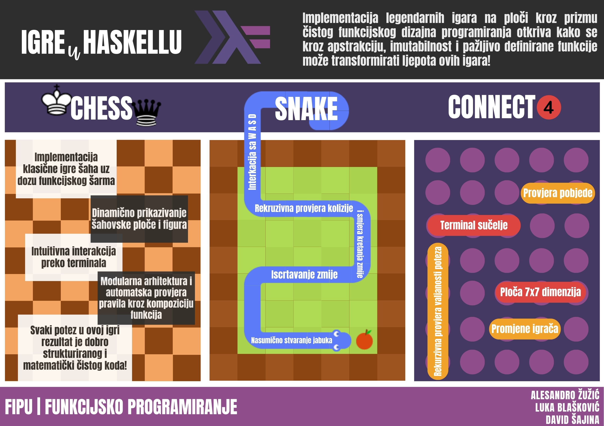

# Izvještaj o projektu iz kolegija "Funkcijsko programiranje"

## Tema

Implementacija igara na ploči u Haskellu koristeći funkcionalne koncepte.
Igre koje su implementirane su: `Šah`, `Snake` i `Connect 4`

## Članovi tima

- Alesandro Žužić (`Šah`)
- Luka Blašković (`Snake`)
- David Šajina (`Connect 4`)

## Ustanova

[Sveučilište Jurja Dobrile u Puli](https://www.unipu.hr/) - [Fakultet informatike u Puli](https://fipu.unipu.hr/)

Kolegij: **Funkcijsko programiranje**

Mentor: [doc. dr. sc. Siniša Miličić](https://fipu.unipu.hr/fipu/sinisa.milicic)



> Poster

U nastavku izvještaji za svaku igru zasebno.

Izvorni kôd cjelokupnog projekta dostupan na [Github repozitoriju](https://github.com/lukablaskovic/HaskelLudens).

# Šah (Alesandro Žužić)

## Uvod

Ovaj projekt implementira klasičnu igru šaha koristeći Haskell i Gloss biblioteku za grafički prikaz. Cilj projekta je pružiti korisnicima funkcionalno i vizualno privlačno okruženje za igranje šaha, integrirajući osnovna pravila i logiku igre sa grafičkim sučeljem.

Projekt je strukturiran kako bi omogućio jednostavno igranje šaha uz mogućnost interakcije putem terminala. Osnovna funkcionalnost uključuje postavljanje i prikaz šahovske ploče, unos poteza od strane igrača, validaciju tih poteza te ažuriranje stanja igre. Gloss biblioteka se koristi za crtanje ploče i figura.

Projekt je organiziran u nekoliko modula, svaki sa specifičnom funkcionalnošću koja doprinosi cjelokupnoj igri šaha. Moduli su dizajnirani tako da omogućuju jednostavno održavanje i proširenje koda. Ova struktura omogućava centralizirano upravljanje šahovskom pločom i figurama, dok se interakcija s igračem odvija putem terminala.


## Sadržaj

1. [Uvod](#uvod)
2. [Ključne Značajke](#ključne-značajke)
3. [Ograničenja Projekta](#ograničenja-projekta)
4. [Organizacija Projekta](#organizacija-projekta)
   - [Moduli Projekta](#moduli-projekta)
5. [Struktura Direktorija](#struktura-direktorija)
6. [Moduli](#moduli)
   - [`main.hs`](#mainhs)
   - [`ChessPieces.hs`](#chesspieceshs)
   - [`ChessSprites.hs`](#chessspriteshs)
   - [`Chessboard.hs`](#chessboardhs)
   - [`ChessLogic.hs`](#chesslogichs)
   - [`PlayerInput.hs`](#playerinpuths)
7. [Funkcijsko programiranje u razvoju šahovske igre](#funkcijsko-programiranje-u-razvoju-šahovske-igre)
8. [Korišteni resursi](#korišteni-resursi)

### Ključne značajke:

1. **Grafički Prikaz**:

   - Koristi Gloss biblioteku za crtanje šahovske ploče i figura.
   - Ploča i figure se kombiniraju i prikazuju u prozoru aplikacije.

2. **Interakcija Igrača**:

   - Igrači mogu unositi poteze putem terminala.
   - Unos se obrađuje u zasebnoj dretvi kako bi se omogućilo paralelno izvršavanje grafičke simulacije i obrade unosa.

3. **Simulacija**:

   - Kontinuirano ažurira prikaz šahovske ploče na temelju poteza igrača.
   - Koristi `simulateIO` iz Gloss biblioteke za upravljanje simulacijom.

4. **Logika Igre**:
   - **Validacija Poteza Igrača**: Provjerava jesu li potezi igrača valjani prema osnovnim pravilima šaha.
   - **Praćenje Boje Igrača**: Ažurira i prati trenutnu boju igrača, osiguravajući da se igrači izmjenjuju u skladu s pravilima.

### Ograničenja projekta

Iako projekt pruža osnovnu funkcionalnost igranja šaha, postoje određena ograničenja i funkcionalnosti koje nisu implementirane:

1. **Nedostatak Napredne Validacije Pravila**:

   - Projekt ne provjerava složena pravila šaha poput rošade, en passant hvatanja, i promocije pijuna.

2. **Nedostatak Grafičkog Korisničkog Sučelja (GUI)**:

   - Interakcija igrača se odvija isključivo putem terminala. Nema implementiranih grafičkih elemenata za unos poteza putem miša ili drugih GUI kontrola.

3. **Nedostatak Provjere Šah-Mata i Pata**:

   - Projekt ne provjerava uvjete za šah-mat ili pat. Igrači moraju sami prepoznati kada je igra završena.

4. **Nedostatak Podešavanja i Opcija Igranja**:

   - Nema mogućnosti odabira različitih postavki igre poput vremenskog ograničenja, različitih početnih pozicija, ili igranja sa specifičnim pravilima.

5. **Nedostatak Spremljenih Partija**:

   - Projekt ne podržava spremanje i učitavanje partija. Svaka igra mora se odigrati u jednom sjedanju.

6. **Nedostatak Zvuka i Animacija**:

   - Projekt ne uključuje zvukove ili animacije za poteze figura, što može umanjiti iskustvo igranja.

7. **Nedostatak AI Protivnika**:
   - Projekt ne podržava igru protiv računala. Nema implementiranog algoritma za umjetnu inteligenciju koja bi igrala poteze protiv ljudskog igrača.

## Organizacija Projekta

Projekt je organiziran u nekoliko modula, svaki sa specifičnom funkcionalnošću koja doprinosi cjelokupnoj igri šaha. Ova modularna struktura olakšava održavanje i proširenje koda.

### Moduli Projekta

1. **Main.hs**

   - **Opis**: Glavni ulazni modul koji pokreće program.
   - **Funkcionalnost**: Inicijalizira šahovsku ploču, boju igrača, pokreće petlju za unos putem terminala i pokreće grafičku simulaciju.

2. **Chessboard.hs**

   - **Opis**: Modul koji definira šahovsku ploču i osnovne operacije na njoj.
   - **Funkcionalnost**:
     - Inicijalizira početno stanje šahovske ploče.
     - Definira funkcije za crtanje šahovske ploče.
     - Pruža funkcije za dohvaćanje i provjeru stanja pojedinih polja na ploči.

3. **ChessSprites.hs**

   - **Opis**: Modul koji se bavi crtanjem šahovskih figura kao spriteova.
   - **Funkcionalnost**: Učitava slike figura i postavlja ih na odgovarajuća mjesta na ploči.

4. **PlayerInput.hs**

   - **Opis**: Modul za rukovanje unosom igrača putem terminala.
   - **Funkcionalnost**:
     - Pokreće petlju koja čeka unos igrača.
     - Validira unose igrača i ažurira stanje šahovske ploče.
     - Upravljanje izmjenom poteza između igrača.

5. **ChessPieces.hs**

   - **Opis**: Modul koji definira šahovske figure i njihove karakteristike.
   - **Funkcionalnost**:
     - Definira tipove podataka za figure i boje.
     - Pruža funkcije za rad s figurama, uključujući njihovu boju i vrstu.

6. **ChessLogic.hs**
   - **Opis**: Modul za implementaciju logike igre.
   - **Funkcionalnost**:
     - Provjerava validnost poteza.
     - Ažurira stanje ploče nakon valjanog poteza.
     - Upravlja izmjenom boje igrača.

### Struktura Direktorija

```
.
├── Main.hs
├── Chessboard.hs
├── ChessSprites.hs
├── PlayerInput.hs
├── ChessPieces.hs
├── ChessLogic.hs
└── sprites
    ├── white_king.bmp
    ├── white_queen.bmp
    ├── white_rook.bmp
    ├── white_bishop.bmp
    ├── white_knight.bmp
    ├── white_pawn.bmp
    ├── black_king.bmp
    ├── black_queen.bmp
    ├── black_rook.bmp
    ├── black_bishop.bmp
    ├── black_knight.bmp
    └── black_pawn.bmp
```

Direktorij `sprites` sadrži BMP slike šahovskih figura koje se koriste za grafički prikaz ploče u igri.

Svaki modul ima specifičnu ulogu i zajedno omogućavaju funkcionalnost šahovske igre. Ova organizacija omogućava jednostavnije upravljanje i proširenje koda, čineći projekt preglednim i modularnim.

# Moduli

## `main.hs`

Ova datoteka implementira jednostavnu šahovsku igru koristeći Haskell i Gloss biblioteku za grafiku. Program uključuje:

1. **Inicijalizacija stanja**:

   - Kreira početno stanje šahovske ploče i postavlja početnu boju igrača na bijelu.
   - Koristi promjenjive reference (`IORef`) za držanje stanja ploče i trenutne boje igrača.

2. **Rukovanje unosom igrača**:

   - Pokreće petlju za unos naredbi igrača u zasebnoj niti koristeći `forkIO`. Ova petlja omogućava igračima da unose poteze putem terminala.

3. **Grafička simulacija**:

   - Pokreće grafičku simulaciju šahovske ploče koristeći Gloss. Simulacija kontinuirano osvježava prikaz ploče.
   - Kombinira vizualni prikaz šahovske ploče i figura kako bi se igračima omogućilo praćenje stanja igre.

4. **Ažuriranje stanja**:
   - Funkcija za ažuriranje stanja ploče koristi se za osvježavanje prikaza na temelju promjena unesenih putem terminala.

### Ključne komponente

- **IORef**: Koristi se za čuvanje i modifikaciju stanja šahovske ploče i trenutne boje igrača.
- **Gloss**: Biblioteka za jednostavno stvaranje grafičkih aplikacija. Koristi se za crtanje šahovske ploče i figura.
- **Concurrency**: `forkIO` se koristi za pokretanje paralelne niti koja rukuje unosom igrača, omogućavajući da grafička simulacija i unos igrača rade istovremeno.

### Proces izvršavanja

1. **Pokretanje programa**: Inicijalizira se početna šahovska ploča i boja igrača.
2. **Paralelno izvršavanje**: Pokreće se petlja za unos igrača u zasebnoj niti.
3. **Grafička simulacija**: Simulacija prikazuje šahovsku ploču i ažurira je na temelju poteza unesenih putem terminala.
4. **Interakcija**: Igrači unose poteze putem terminala, a promjene se prikazuju na grafičkoj ploči u stvarnom vremenu.

```haskell
module Main where

-- Uvoz potrebnih modula
import Data.IORef (IORef, newIORef, readIORef)  -- Uvoz IORef modula za promjenjive reference u IO
import Graphics.Gloss (Display (InWindow), Picture, black, pictures)  -- Uvoz Gloss biblioteke za grafiku
import Graphics.Gloss.Interface.IO.Simulate (ViewPort, simulateIO)  -- Uvoz simulacijskog sučelja Gloss biblioteke za IO
import Control.Concurrent (forkIO)  -- Uvoz modula za istovremeno izvršavanje

-- Uvoz modula projekta
import Chessboard (initialChessboard, drawChessboard, Chessboard)  -- Uvoz funkcija i tipova iz Chessboard modula
import ChessSprites (drawChessboardSprites)  -- Uvoz funkcije za crtanje sprite-ova šahovske ploče
import PlayerInput (terminalInputLoop)  -- Uvoz funkcije za rukovanje unosom igrača
import ChessPieces  -- Uvoz definicija i tipova vezanih uz šahovske figure


-- Glavna ulazna točka programa
main :: IO ()
main = do
  boardRef <- newIORef initialChessboard  -- Kreiraj novi IORef koji sadrži početnu šahovsku ploču
  colorRef <- newIORef White  -- Kreiraj novi IORef koji sadrži početnu boju igrača (Bijela)
  forkIO $ terminalInputLoop boardRef colorRef  -- Pokreni petlju za unos s terminala istovremeno koristeći forkIO
  runProgram boardRef (InWindow "Chessboard" (500, 500) (100, 100))  -- Pokreni simulacijski program s danom referencom ploče i postavkama prikaza


-- Funkcija za pokretanje simulacijskog programa
runProgram :: IORef Chessboard -> Display -> IO ()
runProgram boardRef display =
  simulateIO display black 10 initialChessboard env2Pic (step boardRef)  -- simulateIO pokreće Gloss simulaciju s početnim okruženjem, funkcijom renderiranja i funkcijom koraka ažuriranja


-- Funkcija za pretvaranje šahovske ploče u sliku
env2Pic :: Chessboard -> IO Picture
env2Pic board = do
  sprites <- drawChessboardSprites board  -- Nacrtaj spriteove za šahovsku ploču
  let boardPic = drawChessboard  -- Nacrtaj mrežu šahovske ploče
  return $ pictures [boardPic, sprites]  -- Kombiniraj mrežu i spriteove u jednu sliku koristeći pictures


-- Funkcija za ažuriranje okruženja (šahovske ploče) na temelju IORef
step :: IORef Chessboard -> ViewPort -> Float -> Chessboard -> IO Chessboard
step boardRef _ _ _ = readIORef boardRef  -- Pročitaj trenutno stanje šahovske ploče iz IORef i vrati ga
```

1. **Module Declaration**:

   - `module Main where`: Definira glavni modul programa.

2. **Imports**:

   - `import Data.IORef (IORef, newIORef, readIORef)`: Uvozi funkcije i tipove za rad s promjenjivim referencama u IO monadi.
   - `import Graphics.Gloss (Display (InWindow), Picture, black, pictures)`: Uvozi dijelove Gloss biblioteke potrebne za grafiku, uključujući tipove za prikaz, slike i boje.
   - `import Graphics.Gloss.Interface.IO.Simulate (ViewPort, simulateIO)`: Uvozi Gloss funkcije za simulaciju s IO.
   - `import Control.Concurrent (forkIO)`: Uvozi funkciju za paralelno izvršavanje.
   - `import Chessboard (initialChessboard, drawChessboard, Chessboard)`: Uvozi funkcije i tipove za rad sa šahovskom pločom.
   - `import ChessSprites (drawChessboardSprites)`: Uvozi funkciju za crtanje šahovskih figura kao spriteova.
   - `import PlayerInput (terminalInputLoop)`: Uvozi funkciju za rukovanje unosom igrača s terminala.
   - `import ChessPieces`: Uvozi definicije vezane uz šahovske figure.

3. **Main Function**:

   - `main :: IO ()`: Definira tip glavne funkcije kao IO akciju.
   - `boardRef <- newIORef initialChessboard`: Inicijalizira promjenjivu referencu (`IORef`) za početno stanje šahovske ploče.
   - `colorRef <- newIORef White`: Inicijalizira promjenjivu referencu (`IORef`) za početno stanje boje igrača (`Bijela`).
   - `forkIO $ terminalInputLoop boardRef colorRef`: Pokreće funkciju za unos s terminala paralelno koristeći `forkIO`.
   - `runProgram boardRef (InWindow "Chessboard" (500, 500) (100, 100))`: Pokreće Gloss simulacijski program s referencom na ploču i postavkama prikaza.

4. **runProgram Function**:

   - `runProgram :: IORef Chessboard -> Display -> IO ()`: Definira tip funkcije.
   - `simulateIO display black 10 initialChessboard env2Pic (step boardRef)`: Pokreće Gloss simulaciju:
     - `display`: Postavke prikaza.
     - `black`: Boja pozadine.
     - `10`: Broj simulacijskih koraka u sekundi.
     - `initialChessboard`: Početno stanje šahovske ploče.
     - `env2Pic`: Funkcija za pretvaranje stanja ploče u sliku.
     - `(step boardRef)`: Funkcija za ažuriranje stanja ploče.

5. **env2Pic Function**:

   - `env2Pic :: Chessboard -> IO Picture`: Definira tip funkcije.
   - `sprites <- drawChessboardSprites board`: Crta spriteove šahovske ploče.
   - `let boardPic = drawChessboard`: Crta mrežu šahovske ploče.
   - `return $ pictures [boardPic, sprites]`: Kombinira mrežu i spriteove u jednu sliku koristeći `pictures`.

6. **step Function**:
   - `step :: IORef Chessboard -> ViewPort -> Float -> Chessboard -> IO Chessboard`: Definira tip funkcije.
   - `step boardRef _ _ _ = readIORef boardRef`: Čita i vraća trenutno stanje šahovske ploče iz `IORef`. Dodatni parametri (`ViewPort`, `Float`, `Chessboard`) se ignoriraju u ovoj implementaciji.

#### Što je `IORef`?

`IORef` je referentni tip koji omogućava promjenjivo stanje unutar IO monade. U čisto funkcionalnom jeziku poput Haskella, varijable su nepromjenjive po defaultu. Međutim, ponekad je potrebno raditi s promjenjivim stanjem, na primjer u aplikacijama koje uključuju korisnički unos ili grafičke interfejse. `IORef` omogućava promjenjivo stanje na način koji je siguran unutar IO monade.

`newIORef` prima početnu vrijednost kao argument i vraća `IO` akciju koja stvara novi `IORef` s tom početnom vrijednošću.

### Primjer

U gornjem kodu za igru šah, `newIORef` se koristi za stvaranje referenci na stanje šahovske ploče i trenutnu boju igrača.

```haskell
main :: IO ()
main = do
  boardRef <- newIORef initialChessboard  -- Stvara novi IORef za šahovsku ploču s početnim stanjem
  colorRef <- newIORef White              -- Stvara novi IORef za boju igrača, postavljajući početnu boju na bijelu
  forkIO $ terminalInputLoop boardRef colorRef  -- Pokreće funkciju za unos u zasebnoj dretvi
  runProgram boardRef (InWindow "Chessboard" (500, 500) (100, 100))  -- Pokreće grafičku simulaciju
```

- `boardRef <- newIORef initialChessboard`:

  - Stvara novi `IORef` koji sadrži početno stanje šahovske ploče definirano u `initialChessboard`.
  - `boardRef` je referenca koja omogućava pristup i modifikaciju šahovske ploče u programu.

- `colorRef <- newIORef White`:
  - Stvara novi `IORef` koji sadrži početno stanje boje igrača, koje je `White` (bijela).
  - `colorRef` je referenca koja omogućava pristup i modifikaciju trenutne boje igrača.

Korištenje `newIORef` omogućava upravljanje promjenjivim stanjem u funkcionalnom jeziku poput Haskella na siguran način unutar IO monade. U primjeru šahovske igre, `IORef` omogućava ažuriranje i čitanje stanja šahovske ploče i trenutne boje igrača tijekom izvršavanja programa.

#### Što je `forkIO`?

`forkIO` je funkcija u Haskellovom modulu `Control.Concurrent` koja omogućava paralelno (konkurentno) izvršavanje IO akcija. Omogućava stvaranje novog lakog procesa (eng. lightweight thread) koji se izvršava istovremeno s glavnim programom.

`forkIO` omogućava pokretanje IO akcije u zasebnoj Haskellovoj dretvi (thread), što znači da se ta akcija može izvršavati paralelno s drugim IO akcijama u programu. Haskellove dretve su lake i učinkovite, omogućujući visok stupanj konkurentnosti.

#### Sintaksa

```haskell
forkIO :: IO () -> IO ThreadId
```

- Prima IO akciju (tipa `IO ()`) kao argument.
- Vraća `ThreadId`, identifikator novostvorene dretve.

#### Kako `forkIO` radi?

Kada se `forkIO` pozove s IO akcijom, ta akcija se pokreće u novoj dretvi. Glavna nit nastavlja s izvršavanjem ostatka programa bez čekanja da nova nit završi. Ovo je korisno za zadatke koji se mogu izvoditi paralelno, poput rukovanja korisničkim unosom ili rada s mrežom.

### Primjer

U primjeru šahovske igre, `forkIO` se koristi za pokretanje funkcije `terminalInputLoop` koja rukuje unosom igrača putem terminala u zasebnoj dretvi, dok se grafička simulacija šahovske ploče izvršava u glavnoj dretvi.

```haskell
main :: IO ()
main = do
  boardRef <- newIORef initialChessboard  -- Kreiraj novi IORef koji sadrži početnu šahovsku ploču
  colorRef <- newIORef White  -- Kreiraj novi IORef koji sadrži početnu boju igrača (Bijela)
  forkIO $ terminalInputLoop boardRef colorRef  -- Pokreni petlju za unos s terminala istovremeno koristeći forkIO
  runProgram boardRef (InWindow "Chessboard" (500, 500) (100, 100))  -- Pokreni simulacijski program s danom referencom ploče i postavkama prikaza
```

- `forkIO $ terminalInputLoop boardRef colorRef`:
  - Poziva `forkIO` s akcijom `terminalInputLoop boardRef colorRef`.
  - `terminalInputLoop boardRef colorRef` je funkcija koja se izvršava u zasebnoj dretvi.
  - Ova funkcija rukuje korisničkim unosom putem terminala i ažurira stanje šahovske ploče (`boardRef`) i trenutnu boju igrača (`colorRef`).

#### Prednosti korištenja `forkIO`

- **Paralelizam**: Omogućava izvršavanje više IO akcija paralelno, što može povećati učinkovitost programa.
- **Jednostavnost**: Korištenje `forkIO` je jednostavno i ne zahtijeva složeno upravljanje dretvi.
- **Brza reakcija**: Omogućava brzu reakciju na korisnički unos ili druge vanjske događaje bez blokiranja glavne dretve.

### Što je Gloss?

**Gloss** je Haskellova biblioteka koja olakšava stvaranje 2D grafike, animacija i simulacija. Dizajnirana je za jednostavnost korištenja i omogućava korisnicima da brzo razviju grafičke aplikacije bez potrebe za detaljnim razumijevanjem rada grafičkih sustava.

### Komponente Gloss biblioteke

#### `Graphics.Gloss`

Ovaj modul pruža osnovne funkcije za crtanje i prikaz 2D grafike.

- **`Display (InWindow)`**:

  - `Display`: Tip koji predstavlja različite načine prikaza prozora.
  - `InWindow`: Konstruktor za prikaz aplikacije u prozoru s određenim nazivom, dimenzijama i pozicijom na ekranu.

- **`Picture`**:

  - Tip koji predstavlja slike koje se mogu crtati na ekran. Slike mogu biti osnovni oblici (pravokutnici, krugovi), tekst ili složene slike sastavljene od drugih slika.

- **`pictures`**:
  - Funkcija koja prima listu `Picture` objekata i kombinira ih u jednu sliku. Omogućava crtanje više objekata zajedno.

#### `Graphics.Gloss.Interface.IO.Simulate`

Ovaj modul pruža funkcije za kreiranje interaktivnih simulacija koje mogu reagirati na korisnički unos i mijenjati se tijekom vremena.

- **`ViewPort`**:

  - Tip koji predstavlja trenutno stanje prikaza, uključujući informacije o povećanju i pomicanju prikaza. Koristi se za transformiranje koordinata tijekom crtanja.

- **`simulateIO`**:

  - Funkcija koja omogućava stvaranje simulacija koje se ažuriraju i ponovno crtaju na temelju vremena i korisničkog unosa. Koristi se za definiranje simulacijskog programa u Glossu.

  ```haskell
  simulateIO :: Display       -- Postavke prikaza (prozor, fullscreen, itd.)
             -> Color         -- Boja pozadine
             -> Int           -- Broj simulacijskih koraka u sekundi
             -> world         -- Početno stanje svijeta
             -> (world -> IO Picture)  -- Funkcija za crtanje trenutnog stanja svijeta
             -> (ViewPort -> Float -> world -> IO world)  -- Funkcija za ažuriranje stanja svijeta
             -> IO ()
  ```

### Primjer

U `main.hs` kodu, Gloss biblioteka se koristi za stvaranje prozora u kojem će se prikazivati šahovska ploča i figure. `simulateIO` funkcija se koristi za pokretanje simulacije koja kontinuirano osvježava prikaz na temelju trenutnog stanja šahovske ploče.

- **`Display (InWindow)`**:

  - Koristi se za definiranje prozora aplikacije sa specifičnim nazivom, dimenzijama i pozicijom:
    ```haskell
    InWindow "Chessboard" (500, 500) (100, 100)
    ```

- **`Picture`**:

  - Koristi se za stvaranje i kombiniranje slika šahovske ploče i figura:
    ```haskell
    let boardPic = drawChessboard
    return $ pictures [boardPic, sprites]
    ```

- **`black`**:

  - Postavlja boju pozadine prozora na crnu:
    ```haskell
    simulateIO display black 10 initialChessboard env2Pic (step boardRef)
    ```

- **`pictures`**:

  - Kombinira mrežu šahovske ploče i figure u jednu sliku:
    ```haskell
    return $ pictures [boardPic, sprites]
    ```

- **`simulateIO`**:
  - Pokreće simulaciju koja kontinuirano ažurira i prikazuje šahovsku ploču:
    ```haskell
    simulateIO display black 10 initialChessboard env2Pic (step boardRef)
    ```

### Primjer odvojenih slika i kombinirane slike:

<div style="display: flex; align-items: flex-end;">
  
  
</div>

- **Odvojene slika**: Prikazuje pozadinu, labele, šahovsku ploču, figure kao zasebne slika.
- **Kombinirana slika**: Prikazuje kombinirane slika u jednu sliku koristeći Gloss biblioteku.

Korištenjem funkcije `pictures`, pojedinačne slike (kao što su labele, ploča i figure) mogu se kombinirati u jednu sliku koja se zatim prikazuje korisniku. Ovo omogućava dinamičko i interaktivno ažuriranje prikaza na temelju poteza igrača.

## `ChessPieces.hs`

Modul `ChessPieces.hs` u projektu za šahovsku igru definira osnovne tipove podataka i funkcije povezane sa šahovskim figurama i njihovim karakteristikama. Konkretno, modul pruža:

1. **Definiciju Boja**:

   - Modul definira tip podataka `Color`, koji predstavlja boje šahovskih figura. Dostupne boje su `White` (bijela) i `Black` (crna).

2. **Definiciju Šahovskih Figura**:

   - Modul definira tip podataka `Piece`, koji predstavlja različite vrste šahovskih figura (kralj, kraljica, top, lovac, konj i pješak). Svaka figura je povezana s određenom bojom (`White` ili `Black`).

3. **Definiciju Polja na Šahovskoj Ploči**:

   - Modul definira tip podataka `Square`, koji predstavlja polje na šahovskoj ploči. Polje može biti `Empty` (prazno) ili `Occupied` (zauzeto figurom). Ako je polje zauzeto, čuva se informacija o figuri koja zauzima to polje.

4. **Funkciju za Dobivanje Boje Figure**:
   - Modul pruža funkciju `pieceColor`, koja prima šahovsku figuru i vraća boju te figure. Ovo je korisno za određivanje kojoj boji pripada određena figura tijekom igre.

```haskell
module ChessPieces (Color(..), Piece(..), Square(..), pieceColor) where

-- Modul deklarira koje tipove i funkcije izvozi: Color, Piece, Square i pieceColor

-- Tip podataka koji predstavlja boje šahovskih figura
data Color = White | Black deriving (Eq, Show)
-- data Color definira tip podataka s dvije moguće vrijednosti: White i Black
-- deriving (Eq, Show) automatski generira instance Eq i Show tip klasa za usporedbu i ispis boja

-- Tip podataka koji predstavlja šahovske figure
data Piece = King Color | Queen Color | Rook Color | Bishop Color | Knight Color | Pawn Color deriving (Eq, Show)
-- data Piece definira tip podataka s konstruktorima za svaku figuru (King, Queen, Rook, Bishop, Knight, Pawn)
-- Svaki konstruktor prima argument tipa Color, čime se specificira boja figure
-- deriving (Eq, Show) automatski generira instance Eq i Show tip klasa za usporedbu i ispis figura

-- Tip podataka koji predstavlja polje na šahovskoj ploči
data Square = Empty | Occupied Piece deriving (Eq, Show)
-- data Square definira tip podataka s dvije moguće vrijednosti: Empty i Occupied
-- Konstruktor Occupied prima argument tipa Piece, čime se specificira koja figura zauzima to polje
-- deriving (Eq, Show) automatski generira instance Eq i Show tip klasa za usporedbu i ispis polja

-- Funkcija koja vraća boju figure
pieceColor :: Piece -> Color
pieceColor (King color)   = color
-- Za figuru King, funkcija vraća boju koja je pridružena kralju
pieceColor (Queen color)  = color
-- Za figuru Queen, funkcija vraća boju koja je pridružena kraljici
pieceColor (Rook color)   = color
-- Za figuru Rook, funkcija vraća boju koja je pridružena topu
pieceColor (Bishop color) = color
-- Za figuru Bishop, funkcija vraća boju koja je pridružena lovcu
pieceColor (Knight color) = color
-- Za figuru Knight, funkcija vraća boju koja je pridružena konju
pieceColor (Pawn color)   = color
-- Za figuru Pawn, funkcija vraća boju koja je pridružena pješaku
```

1. **Deklaracije Modula**:

   - `module ChessPieces (Color(..), Piece(..), Square(..), pieceColor) where`:
     - Ova linija definira modul `ChessPieces` i specificira koje tipove podataka i funkcije modul izvozi: `Color`, `Piece`, `Square` i `pieceColor`.

2. **Tip Podatka Boje**:

   - `data Color = White | Black deriving (Eq, Show)`:
     - Definira tip podataka `Color` koji može biti `White` ili `Black`.
     - `deriving (Eq, Show)` automatski generira instance tipova `Eq` (za usporedbu vrijednosti) i `Show` (za pretvaranje u niz za ispis).

3. **Tip Podatka Figure**:

   - `data Piece = King Color | Queen Color | Rook Color | Bishop Color | Knight Color | Pawn Color deriving (Eq, Show)`:
     - Definira tip podataka `Piece` s konstruktorima za svaku vrstu šahovske figure (`King`, `Queen`, `Rook`, `Bishop`, `Knight`, `Pawn`), svaki s argumentom tipa `Color`.
     - `deriving (Eq, Show)` automatski generira instance tipova `Eq` i `Show` za `Piece`.

4. **Tip Podatka Polja**:

   - `data Square = Empty | Occupied Piece deriving (Eq, Show)`:
     - Definira tip podataka `Square` koji može biti `Empty` (prazno) ili `Occupied` (zauzeto figurom tipa `Piece`).
     - `deriving (Eq, Show)` automatski generira instance tipova `Eq` i `Show` za `Square`.

5. **Dohvaćanje Boje Figure**:
   - `pieceColor :: Piece -> Color`:
     - Tip funkcije `pieceColor` koja prima argument tipa `Piece` i vraća vrijednost tipa `Color`.
   - `pieceColor (King color) = color` i slične linije za ostale figure:
     - Funkcija koristi obrasce za raspakiravanje konstruktora `Piece` i vraća pridruženu boju (`color`).
     - Za svaku vrstu figure (`King`, `Queen`, `Rook`, `Bishop`, `Knight`, `Pawn`), funkcija vraća boju koja je pridružena toj figuri.

### Namjena Modula

Modul `ChessPieces.hs` služi kao temelj za definiranje osnovnih elemenata igre šaha. Tipovi podataka i funkcije definirani u ovom modulu koriste se u drugim dijelovima programa za rad s figurama i poljima na ploči. Na primjer, informacije o figurama i njihovim bojama koriste se za provjeru valjanosti poteza, crtanje ploče i figura te logiku igre.

## `ChessSprites.hs`


Modul `ChessSprites.hs` u projektu za šahovsku igru odgovoran je za grafički prikaz šahovskih figura koristeći Gloss biblioteku. Konkretno, modul pruža funkcionalnosti za:

1. **Učitavanje Slika Figura**:

   - Modul učitava slike (spriteove) različitih šahovskih figura iz datoteka. Svaka figura (bijela i crna) ima svoju odgovarajuću sliku koja se koristi za prikaz na ploči.

2. **Crtanje Figura na Šahovskoj Ploči**:

   - Modul definira funkcije za crtanje šahovskih figura na njihovim odgovarajućim pozicijama na ploči. Koristeći Gloss funkcije za transformaciju i prikaz slika, figure se prikazuju na točnim koordinatama ploče.

3. **Kombiniranje Mreže i Figura**:
   - Modul kombinira mrežu šahovske ploče i spriteove figura u jednu sliku koja se prikazuje korisniku. Ovo omogućava da se šahovska ploča i figure prikazuju zajedno u jednom prozoru aplikacije.

```haskell
module ChessSprites (drawChessboardSprites) where

-- Uvoz potrebnih modula
import Graphics.Gloss  -- Uvoz Gloss biblioteke za grafiku
import ChessPieces  -- Uvoz definicija šahovskih figura i boja
import Chessboard  -- Uvoz definicija šahovske ploče

-- Funkcija za učitavanje slika šahovskih figura
loadImages :: IO [(Piece, Picture)]
loadImages = do
    -- Definiranje lista figura i imena datoteka za bijele figure
    let whitePieces = [ (King White, "white_king")
                      , (Queen White, "white_queen")
                      , (Rook White, "white_rook")
                      , (Bishop White, "white_bishop")
                      , (Knight White, "white_knight")
                      , (Pawn White, "white_pawn") ]
        -- Definiranje lista figura i imena datoteka za crne figure
        blackPieces = [ (King Black, "black_king")
                      , (Queen Black, "black_queen")
                      , (Rook Black, "black_rook")
                      , (Bishop Black, "black_bishop")
                      , (Knight Black, "black_knight")
                      , (Pawn Black, "black_pawn") ]
    -- Učitavanje slika za bijele figure i stvaranje parova (figura, slika)
    whiteImages <- mapM (\(piece, fileName) -> (piece,) <$> loadBMP ("sprites/" ++ fileName ++ ".bmp")) whitePieces
    -- Učitavanje slika za crne figure i stvaranje parova (figura, slika)
    blackImages <- mapM (\(piece, fileName) -> (piece,) <$> loadBMP ("sprites/" ++ fileName ++ ".bmp")) blackPieces
    -- Vraćanje kombinirane liste bijelih i crnih slika
    return $ whiteImages ++ blackImages

-- Funkcija za crtanje šahovske ploče sa spriteovima/slikama
drawChessboardSprites :: Chessboard -> IO Picture
drawChessboardSprites board = do
    -- Učitavanje slika figura
    images <- loadImages
    -- Veličina kvadrata na ploči
    let squareSize = 50  -- Podešavanje po potrebi
        -- Pomicanje ploče za centriranje
        xOffset = fromIntegral $ negate $ squareSize * 4 - 25
        yOffset = fromIntegral $ negate $ squareSize * 4 - 25
        -- Stvaranje liste slika za svako polje na ploči
        spriteBoard = [ [ case sq of
                            Empty -> Blank  -- Ako je polje prazno, nema slike
                            -- Ako je polje zauzeto, postavi sliku figure na odgovarajuću poziciju
                            Occupied piece -> translate (fromIntegral (x * squareSize) + xOffset)
                                                        (fromIntegral (y * squareSize) + yOffset)
                                                        (snd $ head $ filter (\(p, _) -> p == piece) images)
                        | (x, sq) <- zip [0..] row ]  -- Iteracija kroz redove i stupce
                      | (y, row) <- zip [0..] board ]  -- Iteracija kroz redove
    -- Vraćanje kombinirane slike ploče i figura
    return $ pictures $ concat spriteBoard
```

1. **Deklaracije Modula**:

   - `module ChessSprites (drawChessboardSprites) where`: Definira modul `ChessSprites` i izvozi funkciju `drawChessboardSprites`.

2. **Uvozi**:

   - `import Graphics.Gloss`: Uvoz Gloss biblioteke za rad s grafikom.
   - `import ChessPieces`: Uvoz modula za rad s šahovskim figurama i bojama.
   - `import Chessboard`: Uvoz modula za rad sa šahovskom pločom.

3. **Učitavanje Slika**:

   - `loadImages :: IO [(Piece, Picture)]`: Definira funkciju koja vraća IO akciju koja učitava slike figura i vraća listu parova (figura, slika).
   - `let whitePieces = ...`: Definira listu bijelih figura i pripadajućih imena datoteka.
   - `let blackPieces = ...`: Definira listu crnih figura i pripadajućih imena datoteka.
   - `whiteImages <- mapM ...`: Učitava slike za bijele figure i stvara parove (figura, slika) koristeći `loadBMP`.
   - `blackImages <- mapM ...`: Učitava slike za crne figure i stvara parove (figura, slika) koristeći `loadBMP`.
   - `return $ whiteImages ++ blackImages`: Vraća kombiniranu listu bijelih i crnih slika figura.

4. **Crtanje Figura**:
   - `drawChessboardSprites :: Chessboard -> IO Picture`: Definira funkciju koja prima šahovsku ploču i vraća IO akciju koja stvara sliku ploče sa figurama.
   - `images <- loadImages`: Učitava slike figura.
   - `let squareSize = 50`: Definira veličinu kvadrata na ploči.
   - `let xOffset = ...`: Računa horizontalni pomak za centriranje ploče.
   - `let yOffset = ...`: Računa vertikalni pomak za centriranje ploče.
   - `let spriteBoard = ...`: Stvara listu slika za svako polje na ploči:
     - `case sq of Empty -> Blank`: Ako je polje prazno, nema slike.
     - `Occupied piece -> translate ...`: Ako je polje zauzeto, postavi sliku figure na odgovarajuću poziciju koristeći `translate`.
     - `| (x, sq) <- zip [0..] row`: Iteracija kroz stupce unutar reda.
     - `| (y, row) <- zip [0..] board`: Iteracija kroz redove ploče.
   - `return $ pictures $ concat spriteBoard`: Vraća kombiniranu sliku ploče i figura koristeći `pictures` i `concat` za spajanje svih slika u jednu.


### Namjena Modula

Modul `ChessSprites.hs` služi za stvaranje vizualnog prikaza šahovske igre. Njegove funkcionalnosti omogućavaju da se šahovske figure pravilno prikazuju na ploči i ažuriraju prema potezima igrača. Korištenjem ovog modula, grafički prikaz igre postaje dinamičan i interaktivan, omogućavajući igračima da jasno vide stanje igre u svakom trenutku.

## `Chessboard.hs`


Modul `Chessboard.hs` u projektu za šahovsku igru odgovoran je za definiciju i manipulaciju šahovske ploče. Konkretno, modul pruža funkcionalnosti za:

1. **Definiciju Šahovske Ploče**:

   - Definira tip podataka `Chessboard`, koji predstavlja šahovsku ploču kao dvodimenzionalni popis (`list`) polja (`Square`).

2. **Inicijalizacija Početnog Stanja Ploče**:

   - Pruža funkciju `initialChessboard`, koja vraća početno stanje šahovske ploče s postavljenim figurama na početne pozicije.

3. **Crtanje Šahovske Ploče**:

   - Definira funkciju `drawChessboard`, koja koristi Gloss biblioteku za crtanje mreže šahovske ploče.

4. **Dohvaćanje i Provjera Stanja Polja**:
   - Pruža funkcije za dohvaćanje stanja specifičnih polja na ploči (`pieceAt`) i provjeru da li je polje prazno (`isEmpty`).

```haskell
module Chessboard (Chessboard, initialChessboard, drawChessboard, pieceAt, isEmpty) where

-- Uvoz potrebnih modula
import Graphics.Gloss  -- Uvoz Gloss biblioteke za rad s grafikom
import ChessPieces  -- Uvoz modula ChessPieces za rad sa šahovskim figurama i poljima

-- Tip sinonim za red šahovske ploče
type Row = [Square]

-- Tip sinonim za šahovsku ploču
type Chessboard = [Row]

-- Početno stanje šahovske ploče s figurama postavljenim na početne pozicije
initialChessboard :: Chessboard
initialChessboard =
  [ [ Occupied (Rook White), Occupied (Knight White), Occupied (Bishop White), Occupied (Queen White)
    , Occupied (King White), Occupied (Bishop White), Occupied (Knight White), Occupied (Rook White) ]
  , replicate 8 (Occupied (Pawn White))  -- Drugi red je popunjen bijelim pješacima
  , replicate 8 Empty  -- Treći do šesti redovi su prazni
  , replicate 8 Empty
  , replicate 8 Empty
  , replicate 8 Empty
  , replicate 8 (Occupied (Pawn Black))  -- Sedmi red je popunjen crnim pješacima
  , [ Occupied (Rook Black), Occupied (Knight Black), Occupied (Bishop Black), Occupied (Queen Black)
    , Occupied (King Black), Occupied (Bishop Black), Occupied (Knight Black), Occupied (Rook Black) ]
  ]

-- Funkcija za crtanje šahovske ploče
drawChessboard :: Picture
drawChessboard = pictures (
    [drawSquare x y | x <- [0..7], y <- [0..7]] ++  -- Crtanje kvadrata za svaki red i stupac
    [drawLabel x y | x <- [0..7], y <- [0..7]] ++  -- Crtanje oznaka za stupce (a-h)
    [drawSideLabel x | x <- [0..7]]  -- Crtanje oznaka za redove (1-8)
  )

-- Funkcija za crtanje pojedinog kvadrata šahovske ploče
drawSquare :: Int -> Int -> Picture
drawSquare x y = translate (fromIntegral x * 50 - 175) (fromIntegral y * 50 - 175) $
                 color (if even (x + y) then darkBrown else lightBrown) $  -- Naizmjenično bojanje kvadrata
                 rectangleSolid 50 50  -- Crtanje kvadrata veličine 50x50

-- Definiranje prilagođenih boja
darkBrown :: Graphics.Gloss.Color
darkBrown = makeColorI 139 69 19 255  -- Smeđa boja (Saddle Brown)

lightBrown :: Graphics.Gloss.Color
lightBrown = makeColorI 244 164 96 255 -- Svijetlosmeđa boja (Sandy Brown)

-- Funkcija za crtanje oznaka za stupce (a-h)
drawLabel :: Int -> Int -> Picture
drawLabel x _ = translate (fromIntegral x * 50 - 175) (-225) $  -- Pomicanje oznake na odgovarajuću poziciju
                scale 0.15 0.15 $ color white $ text [toEnum (fromEnum 'a' + x)]  -- Crtanje oznake stupca

-- Funkcija za crtanje oznaka za redove (1-8)
drawSideLabel :: Int -> Picture
drawSideLabel y = translate (-225) (fromIntegral y * 50 - 175) $  -- Pomicanje oznake na odgovarajuću poziciju
                  scale 0.15 0.15 $ color white $ text (show (9 - (8 - y)))  -- Crtanje oznake reda

-- Funkcija za dohvaćanje figure na danoj poziciji
pieceAt :: Chessboard -> (Int, Int) -> Maybe Piece
pieceAt board (x, y) = case board !! y !! x of  -- Dohvaćanje polja na danoj poziciji
  Occupied piece -> Just piece  -- Ako je polje zauzeto, vraća se figura
  _ -> Nothing  -- Ako je polje prazno, vraća se Nothing

-- Pomoćna funkcija za provjeru je li polje prazno
isEmpty :: Square -> Bool
isEmpty Empty = True  -- Ako je polje prazno, vraća True
isEmpty _ = False  -- U suprotnom, vraća False
```

1. **Deklaracije Modula**:

   - `module Chessboard (Chessboard, initialChessboard, drawChessboard, pieceAt, isEmpty) where`:
     - Definira modul `Chessboard` i specificira koje tipove i funkcije izvozi: `Chessboard`, `initialChessboard`, `drawChessboard`, `pieceAt`, `isEmpty`.

2. **Uvozi**:

   - `import Graphics.Gloss`: Uvoz Gloss biblioteke za rad s grafikom.
   - `import ChessPieces`: Uvoz modula ChessPieces za rad sa šahovskim figurama i poljima.

3. **Sinonimi Tipova**:

   - `type Row = [Square]`: Definira `Row` kao sinonim za listu `Square`.
   - `type Chessboard = [Row]`: Definira `Chessboard` kao sinonim za listu redova (`Row`).

4. **inicijalna Ploča**:

   - `initialChessboard :: Chessboard`: Definira početno stanje šahovske ploče.
   - Popis polja na šahovskoj ploči s figurama postavljenim na početne pozicije:
     - Bijele figure u prvom redu.
     - Bijeli pješaci u drugom redu.
     - Prazna polja u sredini.
     - Crni pješaci u sedmom redu.
     - Crne figure u osmom redu.

5. **Crtanje Ploče**:

   - `drawChessboard :: Picture`: Funkcija koja crta šahovsku ploču koristeći Gloss.
   - Kombinira slike kvadrata, oznaka stupaca i oznaka redova u jednu sliku pomoću `pictures`.

6. **Crtanje Polja**:

   - `drawSquare :: Int -> Int -> Picture`: Funkcija koja crta pojedini kvadrat šahovske ploče.
   - Koristi `translate` za postavljanje kvadrata na odgovarajuću poziciju.
   - Koristi `color` i `rectangleSolid` za crtanje kvadrata odgovarajuće boje.

7. **Boje Polja**:

   - `darkBrown` i `lightBrown`: Definiraju prilagođene boje za kvadrate šahovske ploče.

   -  

8. **Crtanje Labela**:

   - `drawLabel :: Int -> Int -> Picture`: Funkcija koja crta oznake stupaca (a-h).
   - `drawSideLabel :: Int -> Picture`: Funkcija koja crta oznake redova (1-8).
   - 

9. **Dohvaćanje Figure na Poziciji**:

   - `pieceAt :: Chessboard -> (Int, Int) -> Maybe Piece`: Funkcija koja dohvaća figuru na danoj poziciji na ploči.
   - Koristi indeksiranje da bi dohvatila polje i vraća figuru ako je polje zauzeto.

10. **Provjera Praznog Polje**:
    - `isEmpty :: Square -> Bool`: Pomoćna funkcija koja provjerava je li polje prazno (`Empty`).

### Namjena Modula

Modul `Chessboard.hs` služi kao temelj za sve operacije vezane uz šahovsku ploču. Njegove funkcionalnosti omogućavaju:

- Postavljanje početnog stanja igre.
- Crtanje ploče na grafičkom sučelju.
- Manipulaciju pločom tijekom igre, uključujući provjeru i promjenu stanja pojedinih polja.

Ovaj modul je ključan za logiku igre, jer omogućava centralizirano upravljanje šahovskom pločom i interakcijama figura na njoj.

## `ChessLogic.hs`

Modul `ChessLogic.hs` u projektu za šahovsku igru odgovoran je za implementaciju logike igre. Konkretno, modul pruža funkcionalnosti za:

1. **Validaciju Poteza**:

   - Provjerava jesu li potezi figura valjani prema pravilima šaha. Ovo uključuje provjeru specifičnih pravila za svaku figuru, kao što su dozvoljeni pokreti za kralja, kraljicu, topa, lovca, konja i pješaka.

2. **Izvođenje Poteza**:

   - Ažurira stanje šahovske ploče nakon što je potez validiran kao ispravan. Ovo uključuje pomicanje figura i uklanjanje figura koje su pojedene.

3. **Provjeru i Upravljanje Stanjem Igrača**:

   - Upravlja izmjenom poteza između bijelog i crnog igrača. Osigurava da se igrači izmjenjuju pravilno i prati koja je boja trenutno na potezu.

4. **Provjeru Specifičnih Stanja**:
   - Provjerava specifične uvjete igre kao što su šah i mat, te druge specifične poteze poput en passant hvatanja i promocije pješaka.

```haskell
module ChessLogic (makeMove, isValidMove, switchColor) where

-- Uvoz potrebnih modula
import Chessboard (Chessboard, pieceAt)  -- Uvoz modula Chessboard za rad sa šahovskom pločom
import ChessPieces  -- Uvoz modula ChessPieces za rad sa šahovskim figurama

-- Funkcija za promjenu trenutnog igrača
switchColor :: Color -> Color
switchColor White = Black  -- Ako je trenutna boja bijela, promijeni na crnu
switchColor Black = White  -- Ako je trenutna boja crna, promijeni na bijelu

-- Funkcija za obavljanje poteza na šahovskoj ploči ako je potez valjan
makeMove :: Color -> (Int, Int) -> (Int, Int) -> Chessboard -> Maybe Chessboard
makeMove color (fromX, fromY) (toX, toY) board
  -- Provjerava je li potez unutar granica ploče, valjan i je li figura na početnoj poziciji odgovarajuće boje
  | inBounds (fromX, fromY) && inBounds (toX, toY) &&
    isValidMove board (fromX, fromY) (toX, toY) && pieceColorAt board (fromX, fromY) == Just color =
      let piece = board !! fromY !! fromX  -- Dohvati figuru na početnoj poziciji
          -- Ažuriraj redak na ciljnoj poziciji s figurom
          updatedRow row idx newSquare = take idx row ++ [newSquare] ++ drop (idx + 1) row
          -- Ažuriraj ploču s pomaknutom figurom na ciljnu poziciju
          updatedBoard = take toY board ++
                         [updatedRow (board !! toY) toX piece] ++
                         drop (toY + 1) board
          -- Očisti početnu poziciju figure
          clearedBoard = take fromY updatedBoard ++
                         [updatedRow (updatedBoard !! fromY) fromX Empty] ++
                         drop (fromY + 1) updatedBoard
      in Just clearedBoard  -- Vrati ažuriranu ploču
  | otherwise = Nothing  -- Ako je potez nevaljan, vrati Nothing

-- Provjerava je li pozicija unutar granica šahovske ploče
inBounds :: (Int, Int) -> Bool
inBounds (x, y) = x >= 0 && x < 8 && y >= 0 && y < 8  -- Ploča je 8x8, pa x i y moraju biti u rasponu 0-7

-- Funkcija za dohvaćanje boje figure na danoj poziciji
pieceColorAt :: Chessboard -> (Int, Int) -> Maybe Color
pieceColorAt board (x, y) = case board !! y !! x of
  Occupied piece -> Just (pieceColor piece)  -- Ako je polje zauzeto, vrati boju figure
  _ -> Nothing  -- Ako je polje prazno, vrati Nothing

-- Funkcija za validaciju poteza određene figure
isValidMove :: Chessboard -> (Int, Int) -> (Int, Int) -> Bool
isValidMove board (x1, y1) (x2, y2) = case pieceAt board (x1, y1) of
  Just piece ->
    let color = pieceColor piece  -- Dohvati boju figure
    in case pieceAt board (x2, y2) of
         Just destPiece -> pieceColor destPiece /= color && isValidPieceMove piece (x1, y1) (x2, y2) board  -- Provjeri je li ciljna pozicija zauzeta protivničkom figurom i je li potez valjan
         Nothing -> isValidPieceMove piece (x1, y1) (x2, y2) board  -- Ako je ciljna pozicija prazna, provjeri je li potez valjan
  Nothing -> False  -- Ako na početnoj poziciji nema figure, potez nije valjan

-- Funkcija za provjeru valjanosti poteza specifične figure
isValidPieceMove :: Piece -> (Int, Int) -> (Int, Int) -> Chessboard -> Bool
isValidPieceMove (Pawn color) = isValidPawnMove color  -- Provjeri valjanost poteza pješaka
isValidPieceMove (Rook color) = isValidRookMove color  -- Provjeri valjanost poteza topa
isValidPieceMove (Knight color) = isValidKnightMove color  -- Provjeri valjanost poteza konja
isValidPieceMove (Bishop color) = isValidBishopMove color  -- Provjeri valjanost poteza lovca
isValidPieceMove (Queen color) = isValidQueenMove color  -- Provjeri valjanost poteza kraljice
isValidPieceMove (King color) = isValidKingMove color  -- Provjeri valjanost poteza kralja

-- Validacija poteza pješaka (pojednostavljena verzija)
isValidPawnMove :: Color -> (Int, Int) -> (Int, Int) -> Chessboard -> Bool
isValidPawnMove color (x1, y1) (x2, y2) board =
  let direction = if color == White then 1 else -1  -- Smjer kretanja pješaka ovisno o boji
      startRow = if color == White then 1 else 6  -- Početni red pješaka ovisno o boji
      isForwardMove = x1 == x2 && (y2 - y1 == direction || (y1 == startRow && y2 - y1 == 2 * direction))  -- Provjera je li potez naprijed
      isCaptureMove = abs (x2 - x1) == 1 && y2 - y1 == direction && isOccupiedByOpponent color board (x2, y2)  -- Provjera je li potez hvatanje protivničke figure
  in isForwardMove || isCaptureMove  -- Potez je valjan ako je naprijed ili hvatanje

-- Validacija poteza topa
isValidRookMove :: Color -> (Int, Int) -> (Int, Int) -> Chessboard -> Bool
isValidRookMove color (x1, y1) (x2, y2) board =
  (x1 == x2 || y1 == y2) && pathIsClear board (x1, y1) (x2, y2)  -- Potez je valjan ako je u istom stupcu ili redu i putanja je čista

-- Validacija poteza konja
isValidKnightMove :: Color -> (Int, Int) -> (Int, Int) -> Chessboard -> Bool
isValidKnightMove color (x1, y1) (x2, y2) _ =
  (abs (x2 - x1) == 2 && abs (y2 - y1) == 1) || (abs (x2 - x1) == 1 && abs (y2 - y1) == 2)  -- Potez je valjan ako je u obliku slova "L"

-- Validacija poteza lovca
isValidBishopMove :: Color -> (Int, Int) -> (Int, Int) -> Chessboard -> Bool
isValidBishopMove color (x1, y1) (x2, y2) board =
  abs (x2 - x1) == abs (y2 - y1) && pathIsClear board (x1, y1) (x2, y2)  -- Potez je valjan ako se kreće dijagonalno i putanja je čista

-- Validacija poteza kraljice
isValidQueenMove :: Color -> (Int, Int) -> (Int, Int) -> Chessboard -> Bool
isValidQueenMove color (x1, y1) (x2, y2) board =
  isValidRookMove color (x1, y1) (x2, y2) board || isValidBishopMove color (x1, y1) (x2, y2) board  -- Kraljica se može kretati kao top ili lovac

-- Validacija poteza kralja
isValidKingMove :: Color -> (Int, Int) -> (Int, Int) -> Chessboard -> Bool
isValidKingMove color (x1, y1) (x2, y2) _ =
  abs (x2 - x1) <= 1 && abs (y2 - y1) <= 1  -- Kralj se može kretati za jedno polje u bilo kojem smjeru

-- Pomoćne funkcije
-- Provjerava je li polje zauzeto protivničkom figurom
isOccupiedByOpponent :: Color -> Chessboard -> (Int, Int) -> Bool
isOccupiedByOpponent color board (x, y) = case board !! y !! x of
  Occupied piece -> pieceColor piece /= color  -- Ako je polje zauzeto figurom protivnika, vraća True
  _ -> False  -- Inače vraća False

-- Provjerava je li putanja kretanja čista (nema drugih figura na putu)
pathIsClear :: Chessboard -> (Int, Int) -> (Int, Int) -> Bool
pathIsClear board (x1, y1) (x2, y2) =
  let deltaX = signum (x2 - x1)  -- Smjer kretanja po x osi
      deltaY = signum (y2 - y1)  -- Smjer kretanja po y osi
      path = takeWhile (/= (x2, y2)) $ tail $ zip (iterate (+ deltaX) x1) (iterate (+ deltaY) y1)  -- Generiranje putanje između početne i ciljne pozicije
  in all (\(x, y) -> board !! y !! x == Empty) path  -- Provjera je li svako polje na putu prazno
```

1. **Deklaracije Modula**:

   - `module ChessLogic (makeMove, isValidMove, switchColor) where`: Definira modul `ChessLogic` i izvozi funkcije `makeMove`, `isValidMove` i `switchColor`.

2. **Uvozi**:

   - `import Chessboard (Chessboard, pieceAt)`: Uvoz modula `Chessboard` za rad sa šahovskom pločom.
   - `import ChessPieces`: Uvoz modula `ChessPieces` za rad sa šahovskim figurama.

3. **Promjena Boje Igrača**:

   - `switchColor :: Color -> Color`: Funkcija koja mijenja trenutnog igrača.
   - `switchColor White = Black`: Ako je trenutna boja bijela, promijeni na crnu.
   - `switchColor Black = White`: Ako je trenutna boja crna, promijeni na bijelu.

4. **Potez**:

   - `makeMove :: Color -> (Int, Int) -> (Int, Int) -> Chessboard -> Maybe Chessboard`: Funkcija koja obavlja potez na šahovskoj ploči ako je potez valjan.
   - `inBounds (fromX, fromY) && inBounds (toX, toY)`: Provjera je li potez unutar granica ploče.
   - `isValidMove board (fromX, fromY) (toX, toY)`: Provjera je li potez valjan.
   - `pieceColorAt board (fromX, fromY) == Just color`: Provjera je li figura na početnoj poziciji odgovarajuće boje.
   - `updatedRow row idx newSquare`: Ažuriranje retka na ciljnoj poziciji s figurom.
   - `updatedBoard`: Ažuriranje ploče s pomaknutom figurom na ciljnu poziciju.
   - `clearedBoard`: Očisti početnu poziciju figure.
   - `Just clearedBoard`: Vrati ažuriranu ploču ako je potez valjan.
   - `Nothing`: Ako je potez nevaljan, vrati Nothing.

5. **Provjera Pozicije**:

   - `inBounds :: (Int, Int) -> Bool`: Funkcija koja provjerava je li pozicija unutar granica šahovske ploče.
   - `x >= 0 && x < 8 && y >= 0 && y < 8`: Ploča je 8x8, pa x i y moraju biti u rasponu 0-7.

6. **Boja Figure Na Poziciji**:

   - `pieceColorAt :: Chessboard -> (Int, Int) -> Maybe Color`: Funkcija koja dohvaća boju figure na danoj poziciji.
   - `Occupied piece -> Just (pieceColor piece)`: Ako je polje zauzeto, vrati boju figure.
   - `_ -> Nothing`: Ako je polje prazno, vrati Nothing.

7. **Validacija Poteza**:

   - `isValidMove :: Chessboard -> (Int, Int) -> (Int, Int) -> Bool`: Funkcija koja validira potez određene figure.
   - `pieceAt board (x1, y1)`: Dohvaćanje figure na početnoj poziciji.
   - `pieceColor piece`: Dohvaćanje boje figure.
   - `pieceColor destPiece /= color`: Provjera je li ciljna pozicija zauzeta protivničkom figurom.
   - `isValidPieceMove piece (x1, y1) (x2, y2) board`: Provjera je li potez valjan za specifičnu figuru.

8. **Validacija Micanja Figure**:

   - `isValidPieceMove :: Piece -> (Int, Int) -> (Int, Int) -> Chessboard -> Bool`: Funkcija koja provjerava valjanost poteza specifične figure.
   - `isValidPawnMove color`: Provjera valjanosti poteza pješaka.
   - `isValidRookMove color`: Provjera valjanosti poteza topa.
   - `isValidKnightMove color`: Provjera valjanosti poteza konja.
   - `isValidBishopMove color`: Provjera valjanosti poteza lovca.
   - `isValidQueenMove color`: Provjera valjanosti poteza kraljice.
   - `isValidKingMove color`: Provjera valjanosti poteza kralja.

9. **Validacija poteza specifičnih figura**:

   - **`isValidPawnMove`**:

     - Provjerava valjanost poteza pješaka, uzimajući u obzir smjer kretanja (naprijed za bijele, nazad za crne), početni red i mogućnost hvatanja figura protivnika dijagonalno.
     - Ako je pješak u početnom redu, može se pomaknuti za dva polja unaprijed, pod uvjetom da su oba polja prazna
       <br>
     - Hvatanje protivničke figure moguće je samo dijagonalnim potezom u jednom polju unaprijed.
       <br>

   - **`isValidRookMove`**:

     - Provjerava valjanost poteza topa, koji se može kretati horizontalno ili vertikalno bilo kojim brojem polja, pod uvjetom da su sva polja na putu prazna.
     - Ako je putanja slobodna, potez je valjan.
       <br>

   - **`isValidKnightMove`**:

     - Provjerava valjanost poteza konja, koji se može kretati u obliku slova "L" (dva polja u jednom smjeru, zatim jedno polje okomito, ili jedno polje u jednom smjeru, zatim dva polja okomito).
     - Konj može preskakati druge figure na ploči.
       <br>

   - **`isValidBishopMove`**:

     - Provjerava valjanost poteza lovca, koji se može kretati dijagonalno bilo kojim brojem polja, pod uvjetom da su sva polja na putu prazna.
     - Ako je putanja slobodna, potez je valjan.
       <br>

   - **`isValidQueenMove`**:

     - Provjerava valjanost poteza kraljice, koja se može kretati kao top (horizontalno ili vertikalno) ili kao lovac (dijagonalno).
     - Potez je valjan ako je slobodna putanja kao za top ili lovca.
     <div style="display: flex; align-items: center;">
       
       <b style="font-size: 64px; margin: 0 0 16 0;">+</b>
       
       <b style="font-size: 64px; margin: 0 0 16 0;">=</b>
       
     </div>

   - **`isValidKingMove`**:
     - Provjerava valjanost poteza kralja, koji se može kretati jedno polje u bilo kojem smjeru (horizontalno, vertikalno ili dijagonalno).
     - Provjerava se je li potez unutar jednog polja.
       <br>

10. **Pomoćne funkcije**:
    - **`isOccupiedByOpponent`**:
      - Provjerava je li polje zauzeto protivničkom figurom.
      - Ako je figura na polju različite boje od trenutne figure, vraća `True`, inače `False`.
    - **`pathIsClear`**:
      - Provjerava je li putanja kretanja čista, što znači da nema drugih figura na putu između početne i ciljne pozicije.
      - Izračunava korake (`deltaX`, `deltaY`) potrebne za kretanje od početne do ciljne pozicije i provjerava svako polje na putu da li je prazno (`Empty`).
      - Koristi funkcije `iterate` za generiranje koordinata na putu i `takeWhile` za iteraciju do ciljne pozicije.

### Namjena Modula

Modul `ChessLogic.hs` služi kao jezgra logike igre šaha. Njegove funkcionalnosti omogućavaju:

- Validaciju poteza i osiguranje da su svi potezi unutar pravila igre.
- Ažuriranje stanja ploče na temelju poteza igrača.
- Upravljanje izmjenom poteza između igrača i praćenje trenutnog stanja igre.

Ovaj modul je ključan za osiguravanje pravilnog odvijanja igre i za implementaciju osnovnih pravila šaha. Bez njega, igra ne bi mogla pravilno funkcionirati niti bi se mogla osigurati ispravnost poteza.

## `PlayerInput.hs`

<div>
  
  
</div>

terminal_inputs

Modul `PlayerInput.hs` u projektu za šahovsku igru odgovoran je za rukovanje unosom igrača putem terminala. Konkretno, modul pruža funkcionalnosti za:

1. **Petlju za Unos Korisnika**:

   - Implementira petlju koja kontinuirano čeka na unos igrača. Ova petlja omogućava igračima da unesu svoje poteze koristeći terminal.

2. **Validaciju i Obradu Unosa**:

   - Validira unos igrača kako bi osigurala da je u ispravnom formatu (npr. "e2e4" za pomicanje figure s polja e2 na e4).
   - Parsira uneseni potez i ažurira stanje šahovske ploče ako je potez valjan.

3. **Ispis Šahovske Ploče**:

   - Pruža funkcionalnost za ispis trenutnog stanja šahovske ploče na terminal, omogućujući igračima da vide aktualno stanje igre.

4. **Upravljanje Izmjenom Poteza**:
   - Nakon svakog validnog poteza, mijenja boju igrača koji je na potezu, osiguravajući pravilnu izmjenu između bijelog i crnog igrača.

```haskell
module PlayerInput (terminalInputLoop) where

-- Uvoz potrebnih modula
import Data.IORef (IORef, atomicWriteIORef, readIORef)  -- IORef za rad s promjenjivim referencama u IO
import System.IO (hFlush, stdout)  -- hFlush i stdout za ispis i flushanje izlaza
import Control.Monad (forever, unless)  -- forever za beskonačne petlje, unless kao kontrola toka
import ChessLogic (makeMove, isValidMove, switchColor)  -- Uvoz funkcija iz ChessLogic modula
import Chessboard (Chessboard, pieceAt)  -- Uvoz tipa Chessboard i funkcije pieceAt iz Chessboard modula
import ChessPieces  -- Uvoz definicija figura i boja iz ChessPieces modula

-- Glavna petlja za unos s terminala
terminalInputLoop :: IORef Chessboard -> IORef Color -> IO ()
terminalInputLoop boardRef colorRef = forever $ do  -- Beskonačna petlja
  currentColor <- readIORef colorRef  -- Čitanje trenutne boje igrača
  putStrLn $ "Enter command for " ++ show currentColor ++ " (e.g., 'e2e4' or 'pb' to print board): "  -- Ispis poruke za unos
  hFlush stdout  -- Osigurava da se poruka odmah prikaže
  command <- getLine  -- Čitanje unosa igrača
  board <- readIORef boardRef  -- Čitanje trenutnog stanja ploče
  case command of
    "pb" -> printBoard board  -- Ako je unos "pb", ispiši ploču
    _ -> do
      let updatedBoard = case parseCommand command of  -- Parsiranje unosa
            Just (from, to) -> makeMove currentColor from to board  -- Ako je unos valjan, pokušaj obaviti potez
            Nothing -> Nothing  -- Ako nije valjan, vrati Nothing
      case updatedBoard of
        Just newBoard -> do
          atomicWriteIORef boardRef newBoard  -- Ažuriraj ploču s novim stanjem
          atomicWriteIORef colorRef (switchColor currentColor)  -- Promijeni trenutnog igrača
        Nothing -> do
          putStrLn "Invalid command or move. Please try again."  -- Ako je potez nevaljan, ispiši poruku
          case parseCommand command of
            Nothing ->
              putStrLn "   - Invalid command format. Use format 'fromSquare toSquare', e.g., 'e2e4'."  -- Ako je format nevaljan, ispiši poruku
            Just (from, to) -> do
              let pieceAtFrom = pieceAt board from
              case pieceAtFrom of
                Nothing ->
                  putStrLn "   - No piece at the specified 'from' square."  -- Ako nema figure na početnoj poziciji, ispiši poruku
                Just piece -> do
                  let isValid = isValidMove board from to
                  unless isValid $
                    putStrLn "   - Invalid move according to the rules of chess."  -- Ako potez nije valjan, ispiši poruku

-- Funkcija za ispis cijele šahovske ploče
printBoard :: Chessboard -> IO ()
printBoard board = do
  putStrLn "  -----------------"
  mapM_ (\(rank, row) -> putStrLn $ show rank ++ " |" ++ showRow row ++ "|") (reverse numberedRows)  -- Ispis redaka ploče
  putStrLn "  -----------------"
  putStrLn "   a b c d e f g h"

  where
    numberedRows = zip [1..8] board  -- Dodjeljivanje brojeva redovima ploče
    showRow :: [Square] -> String
    showRow row = unwords $ map showPiece row  -- Ispis redaka ploče

-- Funkcija za prikaz pojedine figure ili praznog polja
showPiece :: Square -> String
showPiece (Occupied piece) = showPiece' piece  -- Ako je polje zauzeto, prikaži figuru
showPiece Empty = "."  -- Ako je polje prazno, prikaži točku

-- Funkcija za prikaz pojedine figure
showPiece' :: Piece -> String
showPiece' (Pawn White) = "P"
showPiece' (Rook White) = "R"
showPiece' (Knight White) = "N"
showPiece' (Bishop White) = "B"
showPiece' (Queen White) = "Q"
showPiece' (King White) = "K"
showPiece' (Pawn Black) = "p"
showPiece' (Rook Black) = "r"
showPiece' (Knight Black) = "n"
showPiece' (Bishop Black) = "b"
showPiece' (Queen Black) = "q"
showPiece' (King Black) = "k"

-- Funkcija za parsiranje naredbe poput "e2e4" u parove koordinata
parseCommand :: String -> Maybe ((Int, Int), (Int, Int))
parseCommand "pb" = Just ((0, 0), (7, 7))  -- Ispis cijele ploče
parseCommand command
  | length command == 4 =
      (,) <$> parseSquare (take 2 command) <*> parseSquare (drop 2 command)  -- Parsiranje početne i ciljne pozicije
  | otherwise = Nothing  -- Ako je format nevaljan, vrati Nothing

-- Funkcija za parsiranje polja poput "e2" u par koordinata
parseSquare :: String -> Maybe (Int, Int)
parseSquare [file, rank]
  | file `elem` ['a'..'h'] && rank `elem` ['1'..'8'] = Just (fileToInt file, rankToInt rank)  -- Parsiranje datoteke i ranga
  | otherwise = Nothing  -- Ako su datoteka ili rang nevaljani, vrati Nothing
  where
    fileToInt c = fromEnum c - fromEnum 'a'  -- Konverzija slova u broj
    rankToInt c = fromEnum c - fromEnum '1'  -- Konverzija broja u broj
parseSquare _ = Nothing  -- Ako format nije "xy", vrati Nothing
```

1. **Deklaracije Modula**:

   - Modul `PlayerInput` definira funkciju `terminalInputLoop` koja će biti izvožena.

2. **Uvozi**:

   - `Data.IORef`: Koristi se za rad s promjenjivim referencama (`IORef`), koje omogućuju dijeljenje i modifikaciju stanja između različitih dijelova programa.
   - `System.IO`: Koristi se za rad s unosom i izlazom putem terminala, uključujući ispis i osvježavanje.
   - `Control.Monad`: Pruža pomoćne funkcije `forever` (za beskonačne petlje) i `unless` (za uvjetne provjere).
   - `ChessLogic`: Uvozi funkcije koje upravljaju logikom igre šaha, uključujući `makeMove`, `isValidMove` i `switchColor`.
   - `Chessboard`: Uvozi definicije i funkcije za rad sa šahovskom pločom.
   - `ChessPieces`: Uvozi definicije šahovskih figura i njihovih boja.

3. **Unos Poteza Putem Terminala**:

   - `terminalInputLoop`
   - **Opis**: Beskonačna petlja koja upravlja unosom igrača putem terminala.
   - **Rad**:
     - Čita trenutnu boju igrača iz `IORef`.
     - Prikazuje prompt za unos naredbi.
     - Čeka unos naredbe od igrača.
     - Čita trenutnu ploču iz `IORef`.
     - Obrada naredbi:
       - Ako je naredba "pb", ispisuje ploču.
       - Inače, pokušava parsirati naredbu i izvršiti potez.
     - Ažurira ploču i boju igrača ako je potez valjan, inače prikazuje poruku o pogrešci.

4. **Ispis Trenutnog Stanja**:
   - `printBoard`
   - **Opis**: Ispisuje trenutno stanje šahovske ploče na terminal.
   - **Rad**:
     - Ispisuje gornju granicu ploče.
     - Ispisuje svaki red ploče s odgovarajućim oznakama redova.
     - Ispisuje donju granicu ploče i oznake stupaca.

#### Funkcije za Prikaz Figura

5. **`showPiece`**:

   - **Opis**: Vraća tekstualnu reprezentaciju figure ili praznog polja.
   - **Rad**:
     - Ako je polje zauzeto, poziva `showPiece'` za prikaz figure.
     - Ako je polje prazno, vraća točku (".").

6. **`showPiece'`**:
   - **Opis**: Vraća tekstualnu reprezentaciju pojedine figure.
   - **Rad**:
     - Koristi različite znakove za različite figure, ovisno o njihovoj boji.

#### Funkcije za Parsiranje Naredbi

7. **`parseCommand`**:

   - **Opis**: Parsira naredbu poput "e2e4" u par koordinata.
   - **Rad**:
     - Ako je naredba "pb", vraća par koordinata koji označava ispis ploče.
     - Ako je naredba duljine 4 znaka, pokušava parsirati početnu i ciljnu poziciju.
     - Ako naredba nije valjana, vraća `Nothing`.

8. **`parseSquare`**:
   - **Opis**: Parsira polje poput "e2" u koordinatni par.
   - **Rad**:
     - Provjerava je li unos valjan (polje unutar granica ploče).
     - Konvertira slovo stupca i broj reda u odgovarajuće indekse (0-7).

### Namjena Modula

Modul `PlayerInput.hs` omogućava interaktivnost igre, omogućujući igračima unos poteza i praćenje stanja igre putem terminala. Njegove funkcionalnosti uključuju:

- Kontinuirano praćenje unosa igrača.
- Validaciju i obradu poteza.
- Ažuriranje stanja šahovske ploče.
- Prikaz trenutnog stanja ploče.

Ovaj modul je ključan za omogućavanje dinamične interakcije između igrača i igre, osiguravajući da igra teče glatko i da igrači mogu lako unositi i vidjeti svoje poteze.

#### Control.Monad (forever, unless)

- **forever**:

  - **Opis**: `forever` uzima akciju i ponavlja je beskonačno.
  - **Primjer u šahu**: U `terminalInputLoop` funkciji se koristi `forever` da bi se kontinuirano prihvaćao unos od igrača, omogućujući beskonačnu petlju za unos naredbi.
  - **Primjer**:
    ```haskell
    terminalInputLoop boardRef colorRef = forever $ do
      -- Kod za unos naredbi od igrača ...
    ```

- **unless**:
  - **Opis**: `unless` uzima uvjet i akciju, i izvršava akciju samo ako je uvjet `False`.
  - **Primjer u šahu**: U funkciji za validaciju poteza koristi se `unless` za ispis poruke o nevažećem potezu samo ako potez nije valjan.
  - **Primjer**:
    ```haskell
    unless isValid $
      putStrLn "   - Invalid move according to the rules of chess."
    ```

#### Data.IORef (IORef, atomicWriteIORef, readIORef)

- **IORef**:

  - **Opis**: `IORef` je referenca koja omogućuje mutabilne promjene stanja u Haskellu, unutar IO monada.
  - **Primjer u šahu**: `IORef` se koristi za čuvanje stanja šahovske ploče i trenutne boje igrača.
  - **Primjer**:
    ```haskell
    boardRef <- newIORef initialChessboard
    colorRef <- newIORef White
    ```

- **atomicWriteIORef**:

  - **Opis**: `atomicWriteIORef` atomarno zapisuje novu vrijednost u `IORef`, osiguravajući da se promjena dogodi bez ikakvih međuprostornih stanja.
  - **Primjer u šahu**: Kada se napravi validan potez, ažurira se stanje ploče i boja igrača atomarno.
  - **Primjer**:
    ```haskell
    atomicWriteIORef boardRef newBoard
    atomicWriteIORef colorRef (switchColor currentColor)
    ```

- **readIORef**:
  - **Opis**: `readIORef` čita trenutnu vrijednost iz `IORef`.
  - **Primjer u šahu**: U `terminalInputLoop` funkciji, čita se trenutna boja igrača i stanje ploče.
  - **Primjer**:
    ```haskell
    currentColor <- readIORef colorRef
    board <- readIORef boardRef
    ```

#### System.IO (hFlush, stdout)

- **hFlush**:

  - **Opis**: `hFlush` ispražnjava međuspremnik (buffer) za dani `Handle` (obično `stdout`), osiguravajući da se svi podaci odmah pošalju na izlaz.
  - **Primjer u šahu**: Nakon prikaza prompta za unos, `hFlush` se koristi da bi se osiguralo da prompt bude odmah vidljiv korisniku.
  - **Primjer**:
    ```haskell
    hFlush stdout
    ```

- **stdout**:
  - **Opis**: `stdout` je standardni izlaz, obično terminal ili konzola, gdje se ispisuju podaci.
  - **Primjer u šahu**: Koristi se zajedno s `putStrLn` i `hFlush` za prikazivanje prompta za unos igrača.
  - **Primjer**:
    ```haskell
    putStrLn $ "Enter command for " ++ show currentColor ++ " (e.g., 'e2e4' or 'pb' to print board): "
    hFlush stdout
    ```

## Funkcijsko programiranje u razvoju šahovske igre

### Isticanje upotrebe nemjenjivih struktura podataka i čistih funkcija u razvoju igre

- **Nemjenjive strukture podataka**:

  - U Haskell-u, šahovska ploča je definirana kao nemjenjiva struktura podataka (immutable). Na primjer, `initialChessboard` je nemjenjiva početna ploča igre
  - Promjene stanja ploče rezultiraju novim objektima ploče, umjesto izmjene postojećih, čime se izbjegava neželjene nuspojave.

- **Čiste funkcije**:
  - `makeMove` je čista funkcija koja ne mijenja vanjsko stanje, već vraća novo stanje šahovske ploče

### Demonstracija kako funkcijski pristup pojednostavljuje upravljanje složenim interakcijama unutar igre

- **Jednostavnost upravljanja stanjem**:

  - `isEmpty` funkcija je čista i jednostavna funkcija koja provjerava je li određeno polje prazno
  - Stanje igre se može jednostavno pratiti kroz promjene stanja referenci (`IORef`), koje sadrže trenutno stanje

- **Deklarativan stil**:
  - U funkcijskom programiranju, pravila igre se mogu definirati deklarativno. Na primjer, validacija poteza `isValidMove`

### Usporedba s imperativnim i objektno-orijentiranim pristupima u razvoju softvera za igre

- **Imperativni pristup**:

  - U imperativnom programiranju, promjene stanja su česte i često nepredvidljive. Na primjer, kod u jeziku C#:
    ```csharp
    public void makeMove(Board board, int fromX, int fromY, int toX, int toY) {
        Piece piece = board.Squares[fromY, fromX];
        board.Squares[toY, toX] = piece;
        board.Squares[fromY, fromX] = null;
    }
    ```
  - Ovakav kod može biti složen za praćenje i održavanje zbog izravnog upravljanja memorijom i stanjima.

- **Objektno-orijentirani pristup**:

  - U objektno-orijentiranom programiranju, stanje igre je kapsulirano unutar objekata. Na primjer, kod u jeziku Java:

    ```java
    class ChessGame {
        private Board board;
        private Player currentPlayer;

        public void makeMove(Position from, Position to) {
            Piece piece = board.getPiece(from);
            board.setPiece(to, piece);
            board.setPiece(from, null);
            switchPlayer();
        }
    }
    ```

  - Iako je kod organiziraniji, nasljeđivanje i mutabilnost mogu uzrokovati dodatne komplikacije.

- **Funkcijski pristup**:
  - U funkcijskom programiranju, koristimo nemjenjive strukture i čiste funkcije

### Analiza prednosti funkcijskog pristupa u održivosti i skalabilnosti logike igre

- **Održivost**:

  - Korištenje nemjenjivih struktura i čistih funkcija smanjuje mogućnost grešaka i olakšava razumijevanje koda. Na primjer, `isValidMove` funkcija je izolirana i lako testirana

- **Skalabilnost**:

  - Funkcijski pristup omogućava jednostavno paraleliziranje operacija zbog nemjenjivosti stanja. Na primjer, funkcija `env2Pic` koristi čiste funkcije za prikaz šahovske ploče

- **Testiranje i verifikacija**:
  - Testiranje čistih funkcija je jednostavnije jer su determinističke.
  - Ovo povećava pouzdanost i omogućava jednostavniju detekciju i ispravku grešaka.

### Korišteni resursi

U razvoju ovog projekta korišteni su brojni resursi koji su značajno doprinijeli njegovoj realizaciji. Slijedi detaljan pregled korištenih resursa:

- **Gloss biblioteka za grafiku**:

  - **Opis**: Gloss je Haskellova biblioteka dizajnirana za jednostavno i brzo stvaranje 2D grafike, animacija i simulacija. Pruža intuitivno API sučelje koje omogućava brzo crtanje osnovnih oblika, teksta i slika.
  - **Link**: [Gloss na Hackage-u](https://hackage.haskell.org/package/gloss)
  - **Upotreba u projektu**: Gloss biblioteka je ključna za crtanje šahovske ploče i figura. Omogućila je jednostavno stvaranje i ažuriranje grafičkog prikaza igre, te implementaciju animacija za pomicanje figura.

- **Haskell dokumentacija**:

  - **Opis**: Službena Haskell dokumentacija pruža detaljan pregled jezika, njegovih značajki, te standardnih biblioteka. Sadrži vodiče, referentne materijale i primjere koji pomažu programerima u učenju i primjeni Haskella.
  - **Link**: [Haskell dokumentacija](https://www.haskell.org/documentation/)
  - **Upotreba u projektu**: Dokumentacija je korištena za razumijevanje osnovnih i naprednih koncepta Haskell jezika, kao što su rad s tipovima, IO operacije, rad s listama i funkcionalno programiranje općenito. Također je pružila uvid u korištenje specifičnih biblioteka i modula.

- **Različiti online resursi i tutorijali za funkcionalno programiranje i Haskell**:

  - **Opis**: Online resursi uključuju blogove, tutorijale, forume i video predavanja koji pokrivaju širok raspon tema vezanih uz funkcionalno programiranje i Haskell. Oni su izvor praktičnih savjeta, primjera koda i najbolje prakse.
  - **Primjeri**: - **Learn You a Haskell for Great Good!**: Popularni online vodič i knjiga za učenje Haskella kroz praktične primjere i humorističan pristup. [Learn You a Haskell](http://learnyouahaskell.com/) - **Hoogle**: Online pretraživač za Haskell API-je koji omogućava brzo pronalaženje funkcija i modula prema tipovima i nazivima. [Hoogle](https://hoogle.haskell.org/) - **Stack Overflow**: Forum za programere gdje se može naći mnogo odgovora na specifična pitanja o Haskellu i funkcionalnom programiranju. [Stack Overflow](https://stackoverflow.com/questions/tagged/haskell) - **YouTube kanali**: Kanali koji nude video lekcije i tutorijale o Haskellu i funkcionalnom programiranju, poput kanala [Philipp Hagenlocher](https://www.youtube.com/watch?v=Vgu82wiiZ90&list=PLe7Ei6viL6jGp1Rfu0dil1JH1SHk9bgDV), [
    Beaufort Tek](https://www.youtube.com/watch?v=JjzBFVhkeMA&list=PLmTgnNwroyn8TnF26YRvW-hvQF1ypztzg) i [
    Derek Banas](https://www.youtube.com/watch?v=02_H3LjqMr8).
  - **Upotreba u projektu**: Ovi resursi su korišteni za učenje haskela, rješavanje problema, te za dobivanje inspiracije i ideja za implementaciju različitih značajki igre.

- **Razvojni alati i okruženja**:
  - **Opis**: Različiti alati i okruženja korišteni su za razvoj, testiranje i otklanjanje grešaka u projektu.
  - **GHC (Glasgow Haskell Compiler)**: Standardni kompajler za Haskell koji podržava napredne značajke jezika.
  - **Stack**: Alat za upravljanje projektima i paketima u Haskellu, koji olakšava instalaciju ovisnosti i upravljanje verzijama. [Stack](https://docs.haskellstack.org/en/stable/README/)
  - **VS Code s Haskell ekstenzijama**: Popularni uređivač koda s podrškom za Haskell kroz ekstenziju koja pruža funkcionalnosti poput isticanja sintakse, automatskog dovršavanja koda i integracije s kompajlerom.
    - Haskell Syntax Highlighting
      - Omogućava isticanje sintakse Haskell koda, prepoznajući ključne riječi, tipove, funkcije i komentare.
      - **Značajke**: Isticanje ključnih riječi Haskella, Poboljšanje čitljivosti koda
    - Haskell
      - Pruža integriranu podršku za Haskell razvoj u Visual Studio Code, uključujući isticanje sintakse, automatsko dovršavanje koda, provjeru tipova i integraciju s GHCi.
      - **Značajke**: Automatsko dovršavanje koda, Provjera tipova u stvarnom vremenu, Integracija s GHCi, Navigacija kodom
    - Haskelly
      - Poboljšava iskustvo pisanja Haskell koda, uključujući isticanje sintakse, provjeru tipova i automatsko formatiranje koda.
      - **Značajke**: Isticanje sintakse, Provjera tipova, Automatsko formatiranje koda, Linting

# Snake (Luka Blašković)

Projekt Haskell Snake predstavlja implementaciju popularne igre Snake u programskom jeziku Haskell. Vektorska grafika je relizirana pomoću biblioteke Gloss, dok je igra implementirana funkcionalnih programskih konstrukcija jezika Haskell (uz nekoliko monada :).

Interakcija između igrača i igre se vrši pomoću tipkovnice (tipke W, A, S, D) za kretanje zmije. Cilj igre je sakupiti što više jabuka, a igrač gubi kada zmija udari u zid ili u samu sebe.

Implementacija je podijeljena u nekoliko modula (njih 8 ukupno) koji upravljaju stanjem igre, iscrtavanjem grafičkih elemenata, obradom korisničkih akcija i logikom igre.

<hr>


> Screenshot igre Haskell Snake

## Sadržaj

- [Izvještaj o projektu iz kolegija "Funkcijsko programiranje"](#izvještaj-o-projektu-iz-kolegija-funkcijsko-programiranje)
  - [Tema](#tema)
  - [Članovi tima](#članovi-tima)
  - [Ustanova](#ustanova)
- [Šah (Alesandro Žužić)](#šah-alesandro-žužić)
  - [Uvod](#uvod)
  - [Sadržaj](#sadržaj)
    - [Ključne značajke:](#ključne-značajke)
    - [Ograničenja projekta](#ograničenja-projekta)
  - [Organizacija Projekta](#organizacija-projekta)
    - [Moduli Projekta](#moduli-projekta)
    - [Struktura Direktorija](#struktura-direktorija)
- [Moduli](#moduli)
  - [`main.hs`](#mainhs)
    - [Ključne komponente](#ključne-komponente)
    - [Proces izvršavanja](#proces-izvršavanja)
      - [Što je `IORef`?](#što-je-ioref)
    - [Primjer](#primjer)
      - [Što je `forkIO`?](#što-je-forkio)
      - [Sintaksa](#sintaksa)
      - [Kako `forkIO` radi?](#kako-forkio-radi)
    - [Primjer](#primjer-1)
      - [Prednosti korištenja `forkIO`](#prednosti-korištenja-forkio)
    - [Što je Gloss?](#što-je-gloss)
    - [Komponente Gloss biblioteke](#komponente-gloss-biblioteke)
      - [`Graphics.Gloss`](#graphicsgloss)
      - [`Graphics.Gloss.Interface.IO.Simulate`](#graphicsglossinterfaceiosimulate)
    - [Primjer](#primjer-2)
    - [Primjer odvojenih slika i kombinirane slike:](#primjer-odvojenih-slika-i-kombinirane-slike)
  - [`ChessPieces.hs`](#chesspieceshs)
    - [Namjena Modula](#namjena-modula)
  - [`ChessSprites.hs`](#chessspriteshs)
    - [Namjena Modula](#namjena-modula-1)
  - [`Chessboard.hs`](#chessboardhs)
    - [Namjena Modula](#namjena-modula-2)
  - [`ChessLogic.hs`](#chesslogichs)
    - [Namjena Modula](#namjena-modula-3)
  - [`PlayerInput.hs`](#playerinpuths)
    - [Funkcije za Prikaz Figura](#funkcije-za-prikaz-figura)
    - [Funkcije za Parsiranje Naredbi](#funkcije-za-parsiranje-naredbi)
    - [Namjena Modula](#namjena-modula-4)
      - [Control.Monad (forever, unless)](#controlmonad-forever-unless)
      - [Data.IORef (IORef, atomicWriteIORef, readIORef)](#dataioref-ioref-atomicwriteioref-readioref)
      - [System.IO (hFlush, stdout)](#systemio-hflush-stdout)
  - [Funkcijsko programiranje u razvoju šahovske igre](#funkcijsko-programiranje-u-razvoju-šahovske-igre)
    - [Isticanje upotrebe nemjenjivih struktura podataka i čistih funkcija u razvoju igre](#isticanje-upotrebe-nemjenjivih-struktura-podataka-i-čistih-funkcija-u-razvoju-igre)
    - [Demonstracija kako funkcijski pristup pojednostavljuje upravljanje složenim interakcijama unutar igre](#demonstracija-kako-funkcijski-pristup-pojednostavljuje-upravljanje-složenim-interakcijama-unutar-igre)
    - [Usporedba s imperativnim i objektno-orijentiranim pristupima u razvoju softvera za igre](#usporedba-s-imperativnim-i-objektno-orijentiranim-pristupima-u-razvoju-softvera-za-igre)
    - [Analiza prednosti funkcijskog pristupa u održivosti i skalabilnosti logike igre](#analiza-prednosti-funkcijskog-pristupa-u-održivosti-i-skalabilnosti-logike-igre)
    - [Korišteni resursi](#korišteni-resursi)
- [Snake (Luka Blašković)](#snake-luka-blašković)
  - [Sadržaj](#sadržaj-1)
- [Kako pokrenuti igru](#kako-pokrenuti-igru)
- [Moduli 🛠️](#moduli-️)
  - [\[1\] Main modul 1/2](#1-main-modul-12)
    - [`main` funkcija 🎮](#main-funkcija-)
  - [\[2\] GameState modul](#2-gamestate-modul)
    - [`GameState` tip podatka 🛑](#gamestate-tip-podatka-)
    - [`initialState` funkcija 🆕](#initialstate-funkcija-)
    - [`moveSnake` funkcija 🐍⬆️➡️⬇️⬅️](#movesnake-funkcija-️️️️)
    - [`snakeEatsApple` funkcija 🐍🍎](#snakeeatsapple-funkcija-)
    - [`checkCollision` funkcija 🐍🧱](#checkcollision-funkcija-)
    - [`growSnake` funkcija 🐍🐍🐍](#growsnake-funkcija-)
  - [\[3\] Main modul 2/2 (nastavak)](#3-main-modul-22-nastavak)
    - [`update` funkcija 🔄🔄🔄](#update-funkcija-)
    - [`resetGame` funkcija 🔙](#resetgame-funkcija-)
    - [`handleSnakeMovement` i `updateGameStateAfterMovement` funkcije za kretanje🐍🔄](#handlesnakemovement-i-updategamestateaftermovement-funkcije-za-kretanje)
    - [`handleAppleEaten` i `handleAppleRespawn` funkcije 🍎🍏🍎](#handleappleeaten-i-handleapplerespawn-funkcije-)
  - [\[4\] Apple modul](#4-apple-modul)
    - [`loadAppleSprite` funkcija 🍎🖼️](#loadapplesprite-funkcija-️)
    - [`newApple` funkcija 🆕🍎](#newapple-funkcija-)
    - [`renderApple` funkcija 📽️🍎](#renderapple-funkcija-️)
  - [\[5\] Input modul](#5-input-modul)
    - [`handleEvent` funkcija ⌨️](#handleevent-funkcija-️)
  - [\[6\] AppleCounter modul](#6-applecounter-modul)
    - [Definiranje boje teksta i pomoćna `boldText` funkcija 🎨](#definiranje-boje-teksta-i-pomoćna-boldtext-funkcija-)
    - [`renderAppleCounter` funkcija 📽️🍎🔢](#renderapplecounter-funkcija-️)
  - [\[7\] SnakeRender modul](#7-snakerender-modul)
    - [`loadSnakeSprites` funkcija 🐍🖼️](#loadsnakesprites-funkcija-️)
    - [`directions` i njene pomoćne funkcije 🐍⬆️➡️⬇️⬅️](#directions-i-njene-pomoćne-funkcije-️️️️)
    - [`renderSnake` funkcija 🐍📽️](#rendersnake-funkcija-️)
  - [\[8\] Render modul](#8-render-modul)
    - [`render` funkcija 📽️📺](#render-funkcija-️)
- [Connect 4 (David Šajina)](#connect-4-david-šajina)
  - [Sadržaj](#sadržaj-2)
  - [1. Detaljan opis arhitekture igre i korištenih funkcijskih koncepta](#1-detaljan-opis-arhitekture-igre-i-korištenih-funkcijskih-koncepta)
    - [1.1 Main.hs](#11-mainhs)
    - [1.2. GameLogic.hs](#12-gamelogichs)
    - [1.3. Board.hs](#13-boardhs)
  - [2. Izgled sučelja igre](#2-izgled-sučelja-igre)
  - [3. Analiza funkcijskog programiranja pri upravljanju stanjima igre i korisničkim ulazima](#3-analiza-funkcijskog-programiranja-pri-upravljanju-stanjima-igre-i-korisničkim-ulazima)
    - [3.1 Nepromjenjivost (Immutability):](#31-nepromjenjivost-immutability)
    - [3.2 Čiste funkcije:](#32-čiste-funkcije)
    - [3.3 Rekurzija](#33-rekurzija)
    - [3.4 Upravljanje I/O](#34-upravljanje-io)
  - [4. Diskusija o prednostima i izazovima razvoja igre koristeći funkcijsko programiranje](#4-diskusija-o-prednostima-i-izazovima-razvoja-igre-koristeći-funkcijsko-programiranje)
    - [4.1 Prednosti](#41-prednosti)
    - [4.2 Izazovi:](#42-izazovi)
  - [5. Pregled i usporedba s tradicionalnim pristupima u razvoju igara](#5-pregled-i-usporedba-s-tradicionalnim-pristupima-u-razvoju-igara)
    - [5.1 Tradicionalni pristupi:](#51-tradicionalni-pristupi)
    - [5.2 Funkcijsko programiranje:](#52-funkcijsko-programiranje)

# Kako pokrenuti igru

1. Instalacija Haskell-a, može se preuzeti sa [službene stranice](https://www.haskell.org/downloads/), preporuka je instalirati GHC (Glasgow Haskell Compiler)
2. Instalacija `Stack` alata za upravljanje Haskell bibliotekama i ukupnim projektom, upute su na sljedećem [linku](https://docs.haskellstack.org/en/stable/)
3. Jednom kad su alati instalirani, otvorite terminal i u direktoriju projekta `snake` pokrenite sljedeće naredbe:
   - `stack build` - build cijelog projekta
   - `stack ghc -- -o snake main.hs` - kompilacija `Main.hs` modula
   - `stack.exe` - pokretanje igre

# Moduli 🛠️

## [1] Main modul 1/2

### `main` funkcija 🎮

Glavna `main` funkcija koja pokreće igru.

- funkcija se sastoji od **niza sekvencijalnih naredbi** koje rade unutar monade
- IO (Input/Output) monada se koristi za izvršavanje IO operacija

**1. Postavljanje prozora za igru**

- `Graphics.Gloss | InWindow String (Int, Int) (Int, Int)` - funkcija iz Gloss biblioteke koja postavlja prozor za igru
- `windowWidth` i `windowHeight` parametri predstavljaju širinu i visinu prozora (definirani u `Config modulu`)
- Posljednji argument `(Int, Int)` predstavlja poziciju prozora na ekranu

```haskell
let window = InWindow "Snake Game" (windowWidth, windowHeight) (200, 200)
```

**2. Boja pozadine i FPS**

```haskell
let backgroundColor = black
    framesPerSecond = 60
```

**3. Učitavanje spriteova i inicijalnog stanja igre**

- učitavanje spriteova uz pomoć funkcija `loadAppleSprite` i `loadSnakeSprites` iz modula `Apple` i `SnakeRender`

```haskell
appleSprite <- loadAppleSprite
snakeSprites <- loadSnakeSprites
initialGameState <- initialState
```

**4. Pokretanje simulacije igre**

- `(Graphics.Gloss.Interface.Pure.Game) play` [funkcija iz Gloss biblioteke](https://hackage.haskell.org/package/gloss-1.13.2.2/docs/src/Graphics.Gloss.Interface.Pure.Game.html#play) koja simulira igru.

Funkcija prima 7 parametara:

- **window** (`Display | InWindow`),
- **backgroundColor** (`Color`),
- **framesPerSecond** (`Int`),
- **initialGameState** (`world`),
- **funkcije za iscrtavanje** (**render appleSprite snakeSprites**) (`world -> Picture`),
- **handleEvent** (`Event -> world -> world`) i
- **update** (`Float -> world -> world`)

```haskell
play window backgroundColor framesPerSecond initialGameState (render appleSprite snakeSprites) handleEvent update
```

Cijeli isječak koda:

```haskell
main :: IO ()
main = do
  let window = InWindow "Haskell Snake Game" (windowWidth, windowHeight) (200, 200)
      backgroundColor = black
      framesPerSecond = 60
  appleSprite <- loadAppleSprite
  snakeSprites <- loadSnakeSprites
  initialGameState <- initialState
  play window backgroundColor framesPerSecond initialGameState (render appleSprite snakeSprites) handleEvent update
```

Za razumijevanje ostatka koda `Main` modula, potrebno je proučiti `GameState` modul koji definira istoimeni tip podataka o stanju igre - `GameState`.

## [2] GameState modul

### `GameState` tip podatka 🛑

> Tip podataka koji predstavlja stanje igre

Cijeli isječak koda:

```haskell
data GameState = GameState
  { snake :: [(Float, Float)]   -- Lista koordinata (tuplova) (X, Y) za svaki segment zmije
  , direction :: (Float, Float) -- Trenutni smjer kretanja zmije, tuple (X, Y)
  , apple :: (Float, Float)     -- Koordinate trenutne pozicije jabuke (X, Y)
  , rng :: StdGen               -- Generator slučajnih brojeva za stvaranje novih pozicija jabuke
  , timer :: Float              -- Timer za "apple respawn"
  , appleCount :: Int           -- Brojač pojedenih/sakupljenih jabuka
  , isGameOver :: Bool          -- Game Over flag
  , movementTimer :: Float      -- Timer za kontrolu koliko često se zmija pomiče
  } deriving Show -- Kako bi se GameState mogao ispisati u konzoli
```

### `initialState` funkcija 🆕

> Funkcija koja vraća početno stanje igre (GameState)

- osim tipa `GameState`, funkcija vraća i `IO` monadu jer ima element generiranja slučajnih brojeva
- `gen <- newStdGen` - vezivanje generatora slučajnih brojeva za varijablu `gen`
- `let (applePos, newGen) = newApple gen` - generiranje nove pozicije jabuke
- `return GameState { ... }` - `IO` akcija vraća vrijednost tipa `GameState` (početno stanje igre)

Cijeli isječak koda:

```haskell
initialState :: IO GameState -- IO operacija koja rezultira GameState tipom
initialState = do
  gen <- newStdGen
  let (applePos, newGen) = newApple gen
  return GameState
    { snake = [(0, 0), (cellSize, 0), (2 * cellSize, 0)]
    , direction = (cellSize, 0)
    , apple = applePos
    , rng = newGen
    , timer = 0
    , appleCount = 0
    , isGameOver = False
    , movementTimer = 0
    }
```

### `moveSnake` funkcija 🐍⬆️➡️⬇️⬅️

> Funkcija vraća novu poziciju zmije na temelju trenutnog smjera kretanja (**direction**)

- `GameState` parametar je input,
- `[(Float, Float)]` je povratna vrijednost - lista koordinata `(X, Y)` za svaki segment zmije

funkcija se sastoji od **glavnog izraza** i **where klauzule**

**1. `newHead` - nova pozicija glave zmije**

- izraz vraća **novo stanje tijela zmije**
- `init` funkcija vraća sve elemente liste osim zadnjeg
- `newHead` se dodaje na početak liste tijela zmije, a zatim se uklanja zadnji element `init (snake gameState)`
- `newHead` postaje nova glava zmije

```haskell
newHead : init (snake gameState)
```

**2. `where` klauzula**

- `where` klauzula se koristi za definiranje dodatnih pomoćnih funkcija i varijabli unutar glavnog izraza

- `(dx, dy) = direction gameState` - ekstrakcija trenutnog smjera kretanja iz stanja igre (`dx = delta X, dy = delta Y`) - vektor koji predstavlja **promjenu koordinata X i Y**

- `newHead = (\(x, y) -> (x + dx, y + dy)) (head $ snake gameState)` **izraz koji račune nove koordinate glave zmije**
  - `head $ snake gameState` - head funkcija vraća prvi element liste tijela zmije (dakle glavu)
  - `(\(x, y) -> (x + dx, y + dy))` - lambda izraz koji uzima trenutno poziciju glave i dodaje promjenu koordinata (`dx, dy`)

Cijeli isječak koda:

```haskell
moveSnake :: GameState -> [(Float, Float)]
moveSnake gameState = newHead : init (snake gameState)
  where
    (dx, dy) = direction gameState
    newHead = (\(x, y) -> (x + dx, y + dy)) (head $ snake gameState)
```

### `snakeEatsApple` funkcija 🐍🍎

> Funkcija koja provjerava je li zmija "pojela" jabuku

- `head (snake gameState)` - uzima prvi element liste tijela zmije (`snake gameState`)
- `apple gameState` - uzima trenutnu poziciju jabuke iz stanja igre
- **uspoređuje se pozicija glave zmije i jabuke** i vraća `Bool` rezultata usporedbe

Cijeli isječak koda:

```haskell
snakeEatsApple :: GameState -> Bool
snakeEatsApple gameState = head (snake gameState) == apple gameState
```

### `checkCollision` funkcija 🐍🧱

> Funkcija koja provjerava je li zmija "udarila" u zid ili u samu sebe

- preciznije, provjerava se da li je nova pozicija glave zmije izvan granica prozora ili nalazi li se glava zmije u tijelu zmije

- tuple `(Float, Float)` predstavlja koordinate **glave zmije**
- lista tuplova `[(Float, Float)]` predstavlja **tijelo zmije**

prema tome možemo i podijeliti logiku za provjere sudara na dva (2) dijela:

**1. Provjera sudara sa zidovima**

Provjera ako je `x` koordinata glave zmije manja od lijeve granice prozora. Granica se računa kao `polovica širina prozora - veličina ćelije` gdje je: `veličina ćeije = veličina segmenta zmije`

`x < -fromIntegral windowWidth / 2 + cellSize`

- provjera ako je `x` koordinata glave zmije veća ili jednaka od desne granice prozora

`x >= fromIntegral windowWidth / 2 - cellSize`

- provjerava ako je `y` koordinata glave zmije manja od donje granice prozora

`y < -fromIntegral windowHeight / 2 + cellSize`

- provjera ako je `y` koordinata glave zmije veća ili jednaka od gornje granice prozora

`y >= fromIntegral windowHeight / 2 - cellSize`

- `fromIntegral` koristi se za pretvaranje `windowWidth` i `windowHeight` u `Float` tip podataka kako bismo mogli koristiti operacije s pomičnim zarezom

**2. Provjera sudara sa tijelom zmije**

Provjera je li se zmija sudarila u samu sebe

- jednostavno se provjerava je li glava zmije prisutna u listi pozicija tijela zmije `` (x, y) `elem` body ``

- `elem` funkcija provjerava sadrži li lista element jednak prvom argumentu (u ovom slučaju `(x, y)`)

Cijeli isječak koda:

```haskell
checkCollision :: (Float, Float) -> [(Float, Float)] -> Bool
checkCollision (x, y) body = x < -fromIntegral windowWidth / 2 + cellSize
                          || x >= fromIntegral windowWidth / 2 - cellSize
                          || y < -fromIntegral windowHeight / 2 + cellSize
                          || y >= fromIntegral windowHeight / 2 - cellSize
                          || (x, y) `elem` body
```

### `growSnake` funkcija 🐍🐍🐍

> Rekurzivna funkcija koja povećava tijelo zmije za jedan segment svaki put kada zmija pojede jabuku

- ulazni parametar je lista koordinata (tuplova) `[(Float, Float)]` za svaki segment trenutne zmije
- povratna vrijednost je lista koordinata (tuplova) `[(Float, Float)]` za svaki segment zmije nakon povećanja

1. Korištenje **pattern matchinga**

`growSnake (x:xs) = x : x : xs` - ako lista nije prazna, uzmi prvi element liste `x` i ostatak liste `xs`

`(x:xs)` - razdvaja prvu koordinatu `x` (prvi segment tijela zmije) i ostatak liste `xs`, tj. tijela.

`x : x : xs` - konstruira novu listu gdje se priv segment `x` duplira, tako da se zmija povećava za jedan segment. **Novi segment je kopija prvog segmenta, što znači da će zmija narasti na mjestu svoje glave**.

_Primjer_

Ako je zmija trenutno definirana kao `[(2, 2), (1, 2), (0, 2)]`, poziv `growSnake [(2, 2), (1, 2), (0, 2)]` rezultira novom listom `[(2, 2), (2, 2), (1, 2), (0, 2)]`.

2. **Obrada prazne liste**

- ako nema segmenata (lista je prazna), funkcija jednostavno vraća praznu listu. Ovo je zaštitni mehanizam za slučaj kada se funkcija pozove s praznom listom, kako bi se izbjegla greška.

```haskell
growSnake [] = []
```

Funkcija koristi **rekurziju** kroz uvjetovanje: ako je lista prazna, vraća praznu listu: inače, duplicira prvi segment (glavu) kako bi zmija "narasla".

Cijeli isječak koda:

```haskell
growSnake :: [(Float, Float)] -> [(Float, Float)]
growSnake (x:xs) = x : x : xs
growSnake [] = []
```

> Završetak modula GameState

## [3] Main modul 2/2 (nastavak)

Jednom kad smo definirali `GameState` modul, možemo se vratiti na `Main` modul funkcije i objasniti preostale funkcije budući da intenzivno koriste stanje igre `GameState`.

### `update` funkcija 🔄🔄🔄

> Funkcija vraća novo stanje igre na temelju vremenskog koraka

- `Float` parametar predstavlja vremenski korak (delta vremena) između dva kadra (frame)
- `GameState` parametar predstavlja trenutno stanje igre
- povratna vrijednost je novo stanje igre `GameState`

**1. isječak provjerava je li stanje igre gotovo, ako jest poziva funkciju `resetGame` (u nastavku)**

- `isGameOver gameState = resetGame`

**2. isječak ažurira stanje ako igra nije gotova.**

- Prvo ažuriraj `timer` povećanjem za `seconds` (`gameState { timer = timer gameState + seconds }`)
- `handleSnakeMovement seconds` ažurira poziciju zmije (funkcija u nastavku)
- `handleAppleRespawn` ažurira poziciju jabuke (funkcija u nastavku)

Cijeli isječak koda:

```haskell
update :: Float -> GameState -> GameState
update seconds gameState
  | isGameOver gameState = resetGame
  | otherwise = handleAppleRespawn . handleSnakeMovement seconds $ gameState { timer = timer gameState + seconds }
```


### `resetGame` funkcija 🔙

- funkcija koja resetira igru na početno stanje
- ne prima argumente, a povratna vrijednost je početno stanje igre
- `apple = fst $ newApple rng` - vraća par `(jabuka, novi generator slučajnih brojeva)`
- `rng = mkStdGen 42` - postavlja seed za generator slučajnih brojeva

```haskell
resetGame :: GameState
resetGame = GameState
  { snake = [(0, 0), (cellSize, 0), (2 * cellSize, 0)]
  , direction = (cellSize, 0)
  , apple = fst $ newApple rng
  , rng = snd $ newApple rng
  , timer = 0
  , appleCount = 0
  , isGameOver = False
  , movementTimer = 0
  }
  where
    rng = mkStdGen 42
```

### `handleSnakeMovement` i `updateGameStateAfterMovement` funkcije za kretanje🐍🔄

> Funkcije koje upravljaju kretanjem zmije i vraćanjem novog stanja igre nakon kretnje.

**1. `handleSnakeMovement` funkcija**

Funkcija prima 2 argumenta:

- `Float` - proteklo vrijeme u sekundama između dva kadra
- `GameState` - trenutno stanje igre

Uvjet provjerava je li prošlo dovoljno vremena da se zmije pomakne. Ako je `movementTimer` veći ili jednak `movementThreshold`, poziva se funkcija `updateGameStateAfterMovement` kako bi se ažuriralo stanje igre nakon pokreta zmije.

```haskell
movementTimer gameState >= movementThreshold =
    updateGameStateAfterMovement gameState
```

- Ako nije prošlo dovoljno vremena, ažurira se `movementTimer` dodavanjem proteklog vremena `seconds`.

```haskell
otherwise = gameState { movementTimer = movementTimer gameState + seconds }
```

- `movementThreshold = 0.07` - prag za kretanje zmije. Ako je `movementTimer` veći ili jednak ovom pragu, zmija se pomakne - **ujedno je parametar za kontrolu brzine kretanja zmije** (manji prag = brže kretanje).

Cijeli isječak koda:

```haskell
handleSnakeMovement :: Float -> GameState -> GameState
handleSnakeMovement seconds gameState
  | movementTimer gameState >= movementThreshold = updateGameStateAfterMovement gameState
  | otherwise = gameState { movementTimer = movementTimer gameState + seconds }
  where
    movementThreshold = 0.07
```

**2. `updateGameStateAfterMovement` funkcija**

> Funkcija koja vraća novo stanje igre nakon svake kretnje zmije

- provjerava je li zmija pojela jabuku ili imala sudar
- `GameState` parametar je trenutno stanje igre, a povratna vrijednost je novo stanje igre (`GameState`)

Ako je zmija pojela jabuku (`snakeEatsApple gameState` vraća `True`), poziva se `handleAppleEaten` funkcija (u nastavku) koja vraća novo stanje igre. `snakeEatsApple` funkcija iz `GameState` modula provjerava je li glava zmije na istoj poziciji kao jabuka.

```haskell
snakeEatsApple gameState = handleAppleEaten gameState
```

Ako zmija napravi koliziju (rekli smo da se provjerava sudar glave zmije s tijelom ili zidovima koristeći `checkCollision` funkciju iz `GameState` modula), postavlja se `isGameOver` flag na `True` i `movementTimer` na `0`.

- `head` funkcija uzima prvi element liste tijela zmije (glavu) i provjerava je li došlo do sudara (_no pun intended_)
- `tail` funkcija uzima sve elemente liste osim prvog (preostalo tijelo zmije)

Ako ni ne jede jabuku, niti je u koliziji, ažurira se stanje igre tako da se zmija pomakne na novu poziciju (`newSnake`), a `movementTimer` se resetira.

- izračun nove pozicije zmije `newSnake = GS.moveSnake gameState`. `GS` je alias za `GameState` modul (funkcija `moveSnake` iz `GameState` modula vraća novu poziciju zmije)

Cijeli isječak koda:

```haskell
updateGameStateAfterMovement :: GameState -> GameState
updateGameStateAfterMovement gameState
  | snakeEatsApple gameState = handleAppleEaten gameState
  | checkCollision (head newSnake) (tail newSnake) = gameState { isGameOver = True, movementTimer = 0 }
  | otherwise = gameState { snake = newSnake, movementTimer = 0 }
  where
    newSnake = GS.moveSnake gameState
```


> Ilustracija funkcija za kretanje zmije

### `handleAppleEaten` i `handleAppleRespawn` funkcije 🍎🍏🍎

> Funkcije koje upravljaju scenarijem kada zmija pojede jabuku i kada jabuka treba biti ponovo stvorena

**1. `handleAppleEaten ` funkcija**

> Funkcija koja vraća novo stanje igre nakon što zmija pojede jabuku

- `GameState` parametar je trenutno stanje igre
- povratna vrijednost je novo stanje igre (`GameState`)

Funkcija radi sljedeće:

- `(GameState.hs) growSnake` funkcija povećava tijelo zmije za jedan segment, argument je trenutno tijelo zmije koje se dobiva iz `snake gameState`
- `(Apple.hs) newApple` funkcija vraća novu nasumičnu poziciju jabuke i novi generator slučajnih brojeva koji se pohranjuju u `newApplePos` i `newRng`
- ažurira se stanje igre s novom pozicijom jabuke, novim generatorom i resetiranim timerom za jabuku (`timer`)
- broj jabuka se povećava za 1 (`appleCount`)

Cijeli isječak koda:

```haskell
handleAppleEaten :: GameState -> GameState
handleAppleEaten gameState = gameState
  { snake = growSnake (snake gameState)
  , apple = newApplePos
  , rng = newRng
  , timer = 0
  , appleCount = appleCount gameState + 1
  , movementTimer = 0
  }
  where
    (newApplePos, newRng) = newApple (rng gameState)
```

**2. `handleAppleRespawn` funkcija**

> Funkcija koja vraća novo stanje igre nakon što prođe određeno vrijeme i novom jabukom

- `GameState` parametar je trenutno stanje igre
- povratna vrijednost je novo stanje igre (`GameState`)

Ako je prošlo 5 sekundi (`timer gameState >= 5`), jabuka se ponovno stvara na novoj nasumičnoj poziciji. Nova pozicija jabuke je `newApplePos`, a novi generator slučajnih brojeva je `newRng`. Timer se resetira na 0.

Ako nije prošlo 5 sekundi, stanje igre ostaje nepromijenjeno.
`where` klauzula je ista kao i u `handleAppleEaten` funkciji.

Cijeli isječak koda:

```haskell
handleAppleRespawn :: GameState -> GameState
handleAppleRespawn gameState
  | timer gameState >= 5 = gameState { apple = newApplePos, rng = newRng, timer = 0 }
  | otherwise = gameState
  where
    (newApplePos, newRng) = newApple (rng gameState)
```


> Ilustracija svih funkcija u `Main` modulu

## [4] Apple modul

### `loadAppleSprite` funkcija 🍎🖼️

> Funkcija koja učitava sprite jabuke

- funkcija vraća `IO Picture` monadu jer vraća akciju koja daje objekt tipa `Picture`
- za učitavanje slika koristi se funkcija `loadJuicy` iz [gloss-juicy](https://hackage.haskell.org/package/gloss-juicy) biblioteke
- učitana slika je `Maybe Picture` tipa i koristi se pattern matching za izvlačenje slike iz `Maybe` konteksta
- `do` notacija zbog sekvencijalnih operacija unutar monade

Cijeli isječak koda:

```haskell
loadAppleSprite :: IO Picture
loadAppleSprite = do
  Just apple <- loadJuicy "assets/apple.png"
  return apple
```

### `newApple` funkcija 🆕🍎

> Funkcija koja vraća novu poziciju jabuke i novi generator slučajnih brojeva

- funkcija prima generator slučajnih brojeva `StdGen`
- vraća tuple `(Float, Float), StdGen)` - prva vrijednost je nova pozicija jabuke (tuple), a druga je novi generator slučajnih brojeva

Funkcija generira novu poziciju za jabuku `StdGen` generator.

- `borderOffset = 2 * cellSize` - offset za izbjegavanje rubnog područja. Definira se kao dvostruka veličina ćelije, što znači da se jabuka neće postaviti preblizu ruba prozora.
- `randomR` funkcija generira nasumičan broj unutar određenog raspona. `x` i `y` koordinate se generiraju odvojeno, svaka s vlastitim generatorom (`gen` za `x` i `gen1` za `y`).
- `allignToGrid` je pomoćna funkcija koja se koristi za poravnanje koordinata na mrežu. Funkcija poravnana koordinate na mrežu veličina `cellSize`. Prvo podijeli koordinatu s veličinom ćelije, zatim zaokružuje rezultat na najbliži cijeli broj i množi ga nazad s veličinom ćelije.

Cijeli isječak koda:

```haskell
newApple :: StdGen -> ((Float, Float), StdGen)
newApple gen = ((alignToGrid x, alignToGrid y), newGen)
  where
    borderOffset = 2 * cellSize -- Offset to avoid the border area
    (x, gen1) = randomR (-fromIntegral windowWidth / 2 + borderOffset, fromIntegral windowWidth / 2 - borderOffset) gen
    (y, newGen) = randomR (-fromIntegral windowHeight / 2 + borderOffset, fromIntegral windowHeight / 2 - borderOffset) gen1

alignToGrid :: Float -> Float
alignToGrid coord = fromIntegral (round (coord / cellSize)) * cellSize
```

### `renderApple` funkcija 📽️🍎

> Funkcija koja iscrtava jabuku na ekranu

Koriste se pomoćne funkcije `Gloss` biblioteke za iscrtavanje slike na ekranu:

- `translate :: Float -> Float -> Picture -> Picture` - funkcija koja postavlja sliku na određene koordinate
- `scale :: Float -> Float -> Picture -> Picture` - funkcija koja skalira sliku s danim faktorima na X i Y osi

Slika jabuke se skalira na veličinu (`cellSize / 25`) i postavlja na iste koordinate kao i pozicija jabuke.

```haskell
scale (cellSize / 25) (cellSize / 25) appleSprite
```

Postavljanje skalirane slike na određene koordinate `x` i `y`:

```haskell
translate x y $ scale (cellSize / 25) (cellSize / 25) appleSprite
```

Cijeli isječak koda:

```haskell
renderApple :: Picture -> (Float, Float) -> Picture
renderApple appleSprite (x, y) = translate x y $ scale (cellSize / 25) (cellSize / 25) appleSprite
```

## [5] Input modul

### `handleEvent` funkcija ⌨️

> Funkcija omogućava upravljanje korisniku smjerom kretanja zmije

- Koriste se tipke `w`, `a`, `s`, `d` za kretanje zmije: `gore`, `lijevo`, `dolje` i `desno`

Funkcija prima dva argumenta:

- `(Graphics.Gloss.Interface.Pure.Game) Event` - događaj koji se dogodio (npr. pritisak tipke)
- `GameState` - trenutno stanje igre

Svaka grana funkcije provjerava koja je tipka pritisnuta i ažurira smjer kretanja zmije u skladu s tim. Na primjer, za kretanje "gore" tipkom `w`, koristi se sljedeći izraz:

```haskell
handleEvent (EventKey (Char 'w') Down _ _) gameState
  | direction gameState /= (0, -cellSize) = gameState { direction = (0, cellSize) }
```

- `EventKey (Char 'w') Down _ _` - odgovara događaju kada je pritisnuta tipka `w` i stanje tipke je `Down` (pritisnuta)
- Provjerav se trenutni smjer kretanja zmije `direction gameState` i ažurira se samo ako trenutni smjer nije suprotan odabranom smjeru. Na primjer, ako je zmija kretala prema dolje, ne može se kretati prema gore. Preciznije, ako zmija ne ide dolje ` (0, -cellSize)``, smjer se može promijeniti i mijenja se na gore  `(0, cellSize)`.

Ako se dogodi bilo koji drugi događaj, stanje igre ostaje nepromijenjeno (`handleEvent _ gameState = gameState`).

Cijeli isječak koda:

```haskell
handleEvent :: Event -> GameState -> GameState
handleEvent (EventKey (Char 'w') Down _ _) gameState
  | direction gameState /= (0, -cellSize) = gameState { direction = (0, cellSize) }
handleEvent (EventKey (Char 'a') Down _ _) gameState
  | direction gameState /= (cellSize, 0) = gameState { direction = (-cellSize, 0) }
handleEvent (EventKey (Char 's') Down _ _) gameState
  | direction gameState /= (0, cellSize) = gameState { direction = (0, -cellSize) }
handleEvent (EventKey (Char 'd') Down _ _) gameState
  | direction gameState /= (-cellSize, 0) = gameState { direction = (cellSize, 0) }
handleEvent _ gameState = gameState
```

## [6] AppleCounter modul

Modul sadrži funkciju za iscrtavanje broja jabuka koje je zmija pojela na ekranu.

### Definiranje boje teksta i pomoćna `boldText` funkcija 🎨

Na početku je definirana crvena boja teksta pomoću funkcije `makeColorI` iz modula `Graphics.Gloss.Color` koja prima RGBA vrijednosti.

````haskell

Graphics.Gloss.Color
```haskell
textColor :: Color
textColor = makeColorI 218 72 15 255 -- #DA480F
````

> Funkcija `boldText` crta podebljani tekst

- funkcija je implementirana budući da `Gloss` nema ugrađenu podršku za crtanje boldanog teksta
- funkcija prima `String` odnosno tekst koji se želi prikazati
- vraća `Picture` - sliku koja sadrži tekst

Funkcionalnost se postiže crtanjem teksta više puta s malim pomacima (offsets) u svim smjerovima.

- `offsets = [0, 1, -1]` - lista pomaka za svaki smjer
- `pictures` funkcija kombinira više slika (`Pictures`) u jednu
- `translate x y $ text str` crta tekst `str` s pomakom `(x, y)`

Cijeli isječak koda:

```haskell
boldText :: String -> Picture
boldText str = pictures [translate x y $ text str | x <- offsets, y <- offsets]
  where
    offsets = [0, 1, -1]
```

### `renderAppleCounter` funkcija 📽️🍎🔢

> Funkcija koja iscrtava GUI za broj jabuka na ekranu

Funkcija prima 2 argumenta:

- `Picture` - slika jabuke tj. `appleSprite`
- `Int` - broj jabuka koje je zmija pojela
- povratna vrijednost je `Picture` - objekt koji prikazuje ikonu jabuke i broj jabuka

**1. Izraz za `apple counter` tekst:**

- `translate 50 (-20)` - pomak teksta na koordinate `(50, -20)`
- `scale 0.2 0.2` - skalira tekst na 20% originalne veličine
- `color textColor` - postavlja boju teksta na `textColor`
- `boldText $ "Jabuke: " ++ show count` - crta podebljani tekst koji prikazuje broj jabuka (funkcija `show` pretvara argument u `String`)

```haskell
translate 50 (-20) $ scale 0.2 0.2 $ color textColor . boldText $ "Jabuke: " ++ show count
```

**2. `where` klauzula:**

- `x = -fromIntegral windowWidth / 2` - određivanje lijeve strane ekrana
- `y = fromIntegral windowHeight / 2 - 35` - vrh ekrana, pomaknut za 35 piksela prema dolje
- `appleIcon` - slika jabuke postavljena na koordinate `(25, -10)` i skalirana na originalnoj veličini

```haskell
where
    x = -fromIntegral windowWidth / 2
    y = fromIntegral windowHeight / 2 - 35
    appleIcon = translate 25 (-10) $ scale 1 1 appleSprite
```

Cijeli isječak koda:

```haskell
renderAppleCounter :: Picture -> Int -> Picture
renderAppleCounter appleSprite count = translate x y $ pictures [appleIcon, translate 50 (-20) $ scale 0.2 0.2 $ color textColor . boldText $ "Jabuke: " ++ show count]
  where
    x = -fromIntegral windowWidth / 2
    y = fromIntegral windowHeight / 2 - 35
    appleIcon = translate 25 (-10) $ scale 1 1 appleSprite
```

## [7] SnakeRender modul

Ovaj modul za cilj ima iscrtavanje ispravnih slika (sprite-ova) za svaki segment zmije.

### `loadSnakeSprites` funkcija 🐍🖼️

> IO funkcija koja učitava sprite-ove za svaki segment zmije

- korištenje `loadJuicy` funkcije za učitavanje slika iz datoteka (isto kao kod jabuke)
- nakon što su sve slike učitane, vraća se lista parova `[(String, Picture) ...]` gdje je prvi element ime segmenta zmije, a drugi slika segmenta zmije

Imena elemenata jednaka su nazivima datoteka slika.

Cijeli isječak koda:

```haskell
loadSnakeSprites :: IO [(String, Picture)]
loadSnakeSprites = do
  headLeft <- fromJust <$> loadJuicy "assets/head_left.png"
  headRight <- fromJust <$> loadJuicy "assets/head_right.png"
  headUp <- fromJust <$> loadJuicy "assets/head_up.png"
  headDown <- fromJust <$> loadJuicy "assets/head_down.png"

  bodyHorizontal <- fromJust <$> loadJuicy "assets/body_horizontal.png"
  bodyVertical <- fromJust <$> loadJuicy "assets/body_vertical.png"

  tailUp <- fromJust <$> loadJuicy "assets/tail_up.png"
  tailDown <- fromJust <$> loadJuicy "assets/tail_down.png"
  tailLeft <- fromJust <$> loadJuicy "assets/tail_left.png"
  tailRight <- fromJust <$> loadJuicy "assets/tail_right.png"

  return [ ("head_left", headLeft)
         , ("head_right", headRight)
         , ("head_up", headUp)
         , ("head_down", headDown)
         , ("body_horizontal", bodyHorizontal)
         , ("body_vertical", bodyVertical)
         , ("tail_up", tailUp)
         , ("tail_down", tailDown)
         , ("tail_left", tailLeft)
         , ("tail_right", tailRight)
         ]
```


> Slike sprite-ova za zmiju, [source](https://opengameart.org/content/snake-game-assets)

### `directions` i njene pomoćne funkcije 🐍⬆️➡️⬇️⬅️

> Funkcija i pomoćne funkcije za određivanje smjera kretanja segmenata zmije

Uključene su sljedeće 3 pomoćne funkcije:

- `getBodyDirection` - funkcija određuje smjer segmenata između glave i repa.
- `getHeadDirection ` - funkcija uzima dvije pozicije (prvi i drugi segment zmije) i vraća string koji predstavlja smjer glave te boolean vrijednosti za zrcaljenje.
- `getTailDirection` - funkcija radi slično kao `getHeadDirection`, ali za posljednja dva segmenta zmije.

Funkcija `directions` uzima listu koordinata segmenata `[(Float, Float)]` zmije i vraća **listu smjerova za svaki segment** zmije `[(String, Bool, Bool)]`.

- `String` predstavlja tip segmenta (glava, tijelo, rep) i njegov smjer (_npr. "head_left"_)
- `Bool` vrijednosti predstavljaju treba li sliku segmenta zrcaliti horizontalno ili vertikalno

Ako je lista koordinata prazna, funkcija vraća praznu listu jer nema segmenata za renderiranje.

```haskell
directions [] = []
```

Ako lista koordinata sadrži samo jedan segment (nepotpuna zmija), funkcija također vraća praznu listu jer nije moguće odrediti smjer segmenata.

```haskell
directions snake = headDirection : bodyDirections ++ [tailDirection]
```

Ako lista koordinata sadrži više od jednog segmenta (valjana zmija)m određuju se smjerovi za svaki segment.

- prvo se određuje smjer glave pomoću `headDirection`
- zatim se određuju smjerovi tijela pomoću `bodyDirections`
- na kraju se određuje smjer repa pomoću `tailDirection`

Koriste se operatori `:` (konstrukcija liste) i `++` (konkatenacija listi) kako bismo sastavili konačnu listu smjerova.

Cijeli isječak koda:

```haskell
directions :: [(Float, Float)] -> [(String, Bool, Bool)]
directions [] = []
directions [x] = []
directions snake = headDirection : bodyDirections ++ [tailDirection]
  where
    headDirection = getHeadDirection (snake !! 0) (snake !! 1)
    bodyDirections = zipWith3 getBodyDirection (init (tail snake)) (tail (init snake)) (drop 2 snake)
    tailDirection = getTailDirection (last (init snake)) (last snake)
```

- `getHeadDirection` uzima prve dvije koordinate zmije `snake !! 0` (glava) i `snake !! 1` (prvi segment tijela) te vraća tuple `(String, Bool, Bool)` koji predstavlja smjer glave i boolean vrijednosti za zrcaljenje.

- `bodyDirections` određujemo pomoću funkcije `zipWith3 getBodyDirection`:

  - `init (tail snake)` - uzima sve segmente osim prvog i posljednjeg (glava i rep)
  - `tail (init snake)` - uzima sve segmente zmije osim prvog i posljednjeg, ali pomaknuto za jedno mjesto unaprijed
  - `drop 2 snake` - uzima sve segmente zmije osim prva dva (glava i prvog segmenta tijela)

  - funkcija `zipWith3` primjenjuje `getBodyDirection` na svaku trojku koordinata (prethodni, trenutni i sljedeći segment) i vraća listu smjerova tijela.

- `getTailDirection` uzima zadnje dvije koordinate zmije:
  - `last (init snake)` - predzadnji segment zmije (zadnji segment tijela)
  - `last snake` - zadnji segment zmije (rep)
  - funkcija `getTailDirection` vraća tuple `(String, Bool, Bool)` koji predstavlja smjer repa

```haskell
getHeadDirection :: (Float, Float) -> (Float, Float) -> (String, Bool, Bool)
getHeadDirection (x1, y1) (x2, y2)
  | x1 == x2 && y1 < y2 = ("head_down", False, False)
  | x1 == x2 && y1 > y2 = ("head_up", False, False)
  | x1 < x2 && y1 == y2 = ("head_left", False, False)
  | x1 > x2 && y1 == y2 = ("head_right", False, False)
  | otherwise = ("body_horizontal", False, False)

getTailDirection :: (Float, Float) -> (Float, Float) -> (String, Bool, Bool)
getTailDirection (x1, y1) (x2, y2)
  | x1 == x2 && y1 < y2 = ("tail_up", False, False)
  | x1 == x2 && y1 > y2 = ("tail_down", False, False)
  | x1 < x2 && y1 == y2 = ("tail_right", False, False)
  | x1 > x2 && y1 == y2 = ("tail_left", False, False)
  | otherwise = ("tail_right", False, False)

getBodyDirection :: (Float, Float) -> (Float, Float) -> (Float, Float) -> (String, Bool, Bool)
getBodyDirection (x1, y1) (x2, y2) (x3, y3)
  -- Straight horizontal and vertical segments
  | x1 == x2 && x2 == x3 = ("body_vertical", False, False)
  | y1 == y2 && y2 == y3 = ("body_horizontal", False, False)
  | otherwise = ("body_horizontal", False, False)
```

### `renderSnake` funkcija 🐍📽️

> Funkcija primjenjuje odgovarajući sprite za svaki segment zmije

- funkcija iscrtava zmiju koristeći pomoćne funkcije za određivanje smjera

Funkcija prima 2 argumenta:

- `sprites` lista parova `(String, Picture)` gdje je prvi element ime segmenta zmije, a drugi slika segmenta zmije
- `snake` lista koordinata segmenata zmije `[(Float, Float)]`

**1. Tijelo funkcije:**

Ovdje se koristi funkcija `Graphics.Gloss pictures` funkcija koja spaja više slika u jednu. `zipWith` kombinira dvije liste (`snake` i `directions snake`) koristeći pomoćnu funkciju `renderSegment`. Rezultat je lista segmenata zmije kao slika, koja se zatim spaja u jednu sliku.

```haskell
renderSnake sprites snake = pictures $ zipWith renderSegment snake (directions snake)
```

**2. `renderSegment` i `applyFlip` funkcije:**

Funkcija `renderSegment` iscrtava jedan segment slike i prima 2 argumenta:

- `(x, y)` - koordinate segmenta
- `(dir, flipX, flipY) ` - smjer i informacije o zrcaljenju segmenta

Što se tiće implementacije, funkcija prvo primjenjuje `translate` i `scale` funkcije za postavljanje segmenta na odgovarajuće koordinate i skaliranje na odgovarajuću veličinu (da odgovara veličini ćelije). Zatim se primjenjuje `applyFlip` funkcija za zrcaljenje segmenta smao ako je potrebno.

Odgovarajući sprite se dohvaća iz liste `sprites` koristeći `fromJust` i `lookup` funkcije.

```haskell
  where
    renderSegment (x, y) (dir, flipX, flipY) = translate x y $ scale (cellSize / 40) (cellSize / 40) $ applyFlip flipX flipY $ fromJust (lookup dir sprites)
```

Cijeli isječak koda:

```haskell
renderSnake :: [(String, Picture)] -> [(Float, Float)] -> Picture
renderSnake sprites snake = pictures $ zipWith renderSegment snake (directions snake)
  where
    renderSegment (x, y) (dir, flipX, flipY) = translate x y $ scale (cellSize / 40) (cellSize / 40) $ applyFlip flipX flipY $ fromJust (lookup dir sprites)
    applyFlip True False = scale (-1) 1
    applyFlip False True = scale 1 (-1)
    applyFlip True True = scale (-1) (-1)
    applyFlip False False = id
```

## [8] Render modul

Posljednji modul `render` sadrži istoimenu funkciju za iscrtavanje stanja igre (`GameState`) na ekranu.

Na početku su definirane **boje**. Boje `color1` i `color2` su za crtanje mreže ćelija (grid), dok su boje `edgeColor1` i `edgeColor2` za rubne ćelije mreže.

```haskell
color1, color2, edgeColor1, edgeColor2 :: Color
color1 = makeColorI 167 215 88 255 -- #A7D758
color2 = makeColorI 162 208 82 255 -- #A2D052
edgeColor1 = makeColorI 90 58 18 255 -- #693A12
edgeColor2 = makeColorI 75 48 17 255 -- #5E3511
```

### `render` funkcija 📽️📺

> Funkcija koja iscrtava stanje igre na ekranu

Funkcija prima 3 argumenta:

- `appleSprite` - slika jabuke
- `snakeSprites` - lista sprite-ova za segmente zmije
- `gameState` - trenutno stanje igre

Funkcija vraá `Picture` koja predstavlja cijelu scenu igre. Koristi `pictures` za spajanej više slika u jednu:

- `gridPicture` - slika mreže ćelija
- `snakePicture` - slika zmije
- `applePicture` - slika jabuke
- `appleCounterPicture` - slika broja pojedenih jabuka

**1. Iscrtavanje zmije**

- funkcija kreira sliku zmije pomoću funkcije `renderSnake` iz modula `SnakeRender`, koristeći sprite-ove zmije i koordinate segmenata zmije iz stanja igre (`gameState`).

```haskell
snakePicture = renderSnake snakeSprites (snake gameState)
```

**2. Iscrtavanje jabuke**

- Funkcija kreira sliku jabuke pomoću funkcije `renderApple` iz modula `Apple`, koristeći sliku jabuke i koordinate jabuke iz stanja igre.

```haskell
applePicture = renderApple appleSprite (apple gameState)
```

**3. Iscrtavanje broja jabuka**

- Funkcija kreira sliku broja pojedenih jabuka pomoću funkcije `renderAppleCounter` iz modula `AppleCounter`, koristeći sliku jabuke i broj pojedenih jabuka iz stanja igre.

```haskell
appleCounterPicture = renderAppleCounter appleSprite (appleCount gameState)
```

**4. Iscrtavanje mreže**

- Funkcija kreira sliku mreže koristeći listu koordinata za svaki kvadrat u mreži. Za svaku koordinatu `(x, y)`, kreira se kvadrat `rectangleSolid` veličine `cellSize` i boje određene funkcijom `cellColor`.

```haskell
    -- Create a picture for the grid
    gridPicture = pictures [ translate x y $ color (cellColor x y) $ rectangleSolid cellSize cellSize
                           | x <- [-fromIntegral windowWidth / 2, -fromIntegral windowWidth / 2 + cellSize .. fromIntegral windowWidth / 2 - cellSize]
                           , y <- [-fromIntegral windowHeight / 2, -fromIntegral windowHeight / 2 + cellSize .. fromIntegral windowHeight / 2 - cellSize]
                           ]
```

**5. Funkcija `cellColor`**

Funkcija `cellColor` određuje boju ćelije na poziciji `(x, y)`:

```haskell
cellColor x y
      | isEdge x y = if isEdgeColor1 x y then edgeColor1 else edgeColor2
      | even (floor (x / cellSize) + floor (y / cellSize)) = color1
      | otherwise = color2
```

**6. Funkcija `isEdge`**

Funkcija `isEdge` provjerava je li ćelija na poziciji `(x, y)` rubna ćelija:

```haskell
isEdge :: Float -> Float -> Bool
    isEdge x y = x == -fromIntegral windowWidth / 2
              || x == fromIntegral windowWidth / 2 - cellSize
              || y == -fromIntegral windowHeight / 2
              || y == fromIntegral windowHeight / 2 - cellSize
```

**7. Funkcija `isEdgeColor1`**

Funkcija `isEdgeColor1` određuje treba li rubna ćelija koristiti `edgeColor1` ili `edgeColor2` (boje idu naizmjenično iz estetskih razloga). Koristi isti kriterij pariteta kao i za unutarnje ćelije (`even (floor (x / cellSize) + floor (y / cellSize))`).

Cijeli isječak koda:

```haskell
render :: Picture -> [(String, Picture)] -> GameState -> Picture
render appleSprite snakeSprites gameState = pictures [gridPicture, snakePicture, applePicture, appleCounterPicture]
  where
    -- Create a picture for the snake
    snakePicture = renderSnake snakeSprites (snake gameState)

    -- Create a picture for the apple
    applePicture = renderApple appleSprite (apple gameState)

    -- Create a picture for the apple counter
    appleCounterPicture = renderAppleCounter appleSprite (appleCount gameState)

    -- Create a picture for the grid
    gridPicture = pictures [ translate x y $ color (cellColor x y) $ rectangleSolid cellSize cellSize
                           | x <- [-fromIntegral windowWidth / 2, -fromIntegral windowWidth / 2 + cellSize .. fromIntegral windowWidth / 2 - cellSize]
                           , y <- [-fromIntegral windowHeight / 2, -fromIntegral windowHeight / 2 + cellSize .. fromIntegral windowHeight / 2 - cellSize]
                           ]

    -- Determine the color of the cell
    cellColor x y
      | isEdge x y = if isEdgeColor1 x y then edgeColor1 else edgeColor2
      | even (floor (x / cellSize) + floor (y / cellSize)) = color1
      | otherwise = color2

    isEdge :: Float -> Float -> Bool
    isEdge x y = x == -fromIntegral windowWidth / 2
              || x == fromIntegral windowWidth / 2 - cellSize
              || y == -fromIntegral windowHeight / 2
              || y == fromIntegral windowHeight / 2 - cellSize

    -- Determine if the edge cell should use edgeColor1 or edgeColor2
    isEdgeColor1 x y = even (floor (x / cellSize) + floor (y / cellSize))
```


> Prikaz funkcije `render`, njenih ulaznih parametara i povratne `pictures` vrijednosti

# Connect 4 (David Šajina)

## Sadržaj

- 1. Detaljan opis arhitekture igre i korištenih funkcijskih koncepta
  - 1.1 Main.hs
  - 1.2. GameLogic.hs
  - 1.3. Board.hs
- 2. Izgled sučelja igre
- 3. Analiza funkcijskog programiranja pri upravljanju stanjima igre i korisničkim ulazima
  - 3.1 Nepromjenjivost (Immutability):
  - 3.2 Čiste funkcije:
  - 3.3 Rekurzija
  - 3.4 Upravljanje I/O
- programiranje 4. Diskusija o prednostima i izazovima razvoja igre koristeći funkcijsko
  - 4.1 Prednosti
  - 4.2 Izazovi
- 5. Pregled i usporedba s tradicionalnim pristupima u razvoju igara
  - 5.1 Tradicionalni pristupi:
  - 5.2 Funkcijsko programiranje:

<h1><b>Razvoj igre Connect 4 u Haskell-u koristeći funkcijsko programiranje</b></h1>

## 1. Detaljan opis arhitekture igre i korištenih funkcijskih koncepta

Igra Connect 4 implementirana je u Haskell-u koristeći tri glavna modula: `Main`, `GameLogic`, i
`Board`. Svaki modul ima specifičnu ulogu u arhitekturi igre.

### 1.1 Main.hs

- Modul `Main` sadrži glavni ulaz u program i kontrolira tok igre.
- `main` funkcija postavlja način za standardni izlaz i započinje igru pozivajući `gameLoop` s
  inicijalnom pločom i igračem 1.
- `gameLoop` je rekurzivna funkcija koja prikazuje ploču, prima ulaz korisnika (stupac), provjerava
  valjanost poteza, ažurira ploču i provjerava je li igra završena (pobjeda ili neriješeno). Ako igra nije
  gotova, poziva se rekurzivno za sljedećeg igrača.

```haskell
gameLoop :: Board -> Int -> IO ()
gameLoop board player = do
  printBoard board
  putStrLn $ "Player " ++ show player ++ "'s turn. Enter column (1-7):"
  col <- getLine
  let column = read col - 1
  if isValidMove board column
    then do
      let newBoard = makeMove board column player
      if checkWin newBoard player
        then printBoard newBoard >> putStrLn ("Player " ++ show player ++ " won, game over.")
        else
          if isBoardFull newBoard
            then printBoard newBoard >> putStrLn "The game is a draw!"
            else gameLoop newBoard (switchPlayer player)
    else putStrLn "Invalid move. Try again." >> gameLoop board player
```

### 1.2. GameLogic.hs

- Modul `GameLogic` sadrži funkcije vezane za logiku igre.

- `switchPlayer` mijenja trenutnog igrača.

```switchPlayer :: Int -> Int
switchPlayer 1 = 2
switchPlayer 2 = 1
```

- `checkWin` provjerava je li trenutni igrač pobijedio. Ova funkcija koristi različite smjerove za
  provjeru linija (horizontalne, vertikalne, dijagonalne) i poziva pomoćne funkcije da provjeri sve
  pozicije na ploči.

```haskell
checkWin :: Board -> Int -> Bool
checkWin board player = any (checkDirection player) directions
  where

    -- smjerovi za provjeru pobjede
    directions = [horizontal, vertical, diagonal1, diagonal2]
    horizontal = [(0, 0), (0, 1), (0, 2), (0, 3)]
    vertical = [(0, 0), (1, 0), (2, 0), (3, 0)]
    diagonal1 = [(0, 0), (1, 1), (2, 2), (3, 3)]
    diagonal2 = [(0, 0), (1, -1), (2, -2), (3, -3)]

    -- provjera svih smjerova
    checkDirection :: Int -> [(Int, Int)] -> Bool
    checkDirection player direction = any (hasLine player direction) allPositions


    allPositions = [(row, col) | row <- [0 .. 5], col <- [0 .. 6]]

    -- provjera 4 tocke u liniji (horizontalno, vertikalno, diagonalno ljevo, diagonalno desno)
    hasLine :: Int -> [(Int, Int)] -> (Int, Int) -> Bool
    hasLine player direction (row, col) = all (isValidAndMatches player) (map (applyDirection (row, col)) direction)

    applyDirection :: (Int, Int) -> (Int, Int) -> (Int, Int)
    applyDirection (row, col) (dRow, dCol) = (row + dRow, col + dCol)

    isValidAndMatches :: Int -> (Int, Int) -> Bool
    isValidAndMatches player (newRow, newCol) =
      isInBounds (newRow, newCol) && (board !! newRow !! newCol) == player

    -- Unutar polja (1-7)
    isInBounds :: (Int, Int) -> Bool
    isInBounds (row, col) = row >= 0 && row < 6 && col >= 0 && col < 7
```

### 1.3. Board.hs

- Modul `Board` upravlja pločom igre.
- `initialBoard` postavlja početnu ploču kao listu lista s vrijednostima 0 (prazno).

```haskell
initialBoard :: Board
initialBoard = replicate 7 (replicate 7 0)
```

- `printBoard` ispisuje ploču u čitljivom formatu.

```haskell
printBoard board = do
  mapM_ printRow (transpose board)
  putStrLn " 1 2 3 4 5 6 7"
  where
    printRow row = putStrLn $ concatMap showCell row
    showCell 0 = " ."
    showCell 1 = " X"
    showCell 2 = " O"
```

- `makeMove` ažurira ploču za određenog igrača u danom stupcu.

```haskell
makeMove :: Board -> Int -> Int -> Board
makeMove board col player =
  let (before, targetCol : after) = splitAt col board
      newCol = placeInColumn targetCol player
   in before ++ (newCol : after)
  where
    placeInColumn :: [Int] -> Int -> [Int]
    placeInColumn col player = reverse (placeDisc (reverse col) player)

    placeDisc (0 : xs) p = p : xs
    placeDisc (x : xs) p = x : placeDisc xs p
    placeDisc [] _ = [] – Slucaj da je pun stupac
```

- `isValidMove` provjerava je li potez valjan (tj. je li stupac unutar granica i ima li slobodnih mjesta).

```haskell
isValidMove :: Board -> Int -> Bool
isValidMove board col
  | col < 0 || col >= length board = False – Provjera da je u rangu.
  | otherwise = any (== 0) (board !! col)
```

- `isBoardFull` provjerava je li ploča puna.

```isBoardFull :: Board -> Bool
isBoardFull = all (all (/= 0))
```

## 2. Izgled sučelja igre

Sučelje je napravljeno u terminalu bez nikakvog dodatnog paketa za GUI

Možemo vidjeti kako izgleda inicijalna ploča koja se sastoji od 7x7 polja (Slika 1).


Slika 1 : Prikaz inicijalne ploče

Nakon pokrenute igre, igrač unosi u koji stupac želi staviti svoju točku (Slika 2)


Slika 2: Prikaz odigranog poteza 1 igrača 1

Nakon što je igrač 1 odigrao, dolazi na red igrač 2 (Slika 3)


Slika 3: Prikaz odigranog poteza za igrača 2

Nakon što igrač postavi 4 točke u horizontalnu, vertikalnu ili dijagonalnu liniju pobjedi (Slika 4)


Slika 4: Prikaz pobjede igrača 1

## 3. Analiza funkcijskog programiranja pri upravljanju stanjima igre i korisničkim ulazima

Funkcijsko programiranje koristi nepromjenjive podatke i čiste funkcije, što olakšava upravljanje
stanjima igre. Evo kako se to manifestira u ovoj igri:

### 3.1 Nepromjenjivost (Immutability):

- Stanja igre (ploča) su nepromjenjiva. Svaka promjena stanja rezultira novom pločom, dok
  originalna ostaje nepromijenjena. To pomaže u izbjegavanju grešaka povezanih s nepredvidivim
  promjenama stanja.

### 3.2 Čiste funkcije:

- Funkcije kao što su `makeMove`, `checkWin` i `switchPlayer` su čiste, što znači da uvijek daju isti
  izlaz za isti ulaz bez nuspojava. Ovo čini testiranje i razumijevanje koda lakšim.

### 3.3 Rekurzija

- Rekurzivne funkcije, poput `gameLoop`, omogućuju elegantno upravljanje ponavljajućim
  procesima (na primjer, izmjenom poteza između igrača) bez potrebe za eksplicitnim petljama ili
  mutabilnim varijablama.

### 3.4 Upravljanje I/O

- Ulazi korisnika se čitaju i obrađuju na način koji minimizira mogućnost grešaka. Na primjer, unos
  stupca se validira prije nego što se potez napravi.

## 4. Diskusija o prednostima i izazovima razvoja igre koristeći funkcijsko programiranje

### 4.1 Prednosti

1. Jednostavnost i jasnoća:

- Kod je često kraći i jednostavniji za razumijevanje zbog deklarativnog pristupa i fokusiranja na
  "što" treba učiniti umjesto "kako".

2. Manje grešaka:

- Nepromjenjivost i čiste funkcije smanjuju mogućnost grešaka povezanih s promjenama stanja i
  nuspojavama.

3. Lakše testiranje:

- Zbog čistoće funkcija, testiranje je jednostavnije jer funkcije nemaju nuspojave i uvijek daju isti
  rezultat za isti ulaz.

### 4.2 Izazovi:

1. Učenje i prilagodba:

- Teža prilagodba na funkcijski stil nakon navike imperativnog programiranja zbog drugačijeg načina
  razmišljanja i rješavanja problema.

2. Debugging:

- Debugging funkcijskog koda je puno izazovniji zbog rekurzivnih poziva i manjka eksplicitnih stanja.
  Teže je diagnosticirati gdje je nešto pošlo po krivom. Nije jednostavno kao što je to za imperativne
  jezike.

3. Kompleksnost u složenijim projektima:

- Kada projekti počnu skalirati, počinje biti jako teško pratiti sve funkcije, stanja i interakcije.

## 5. Pregled i usporedba s tradicionalnim pristupima u razvoju igara

### 5.1 Tradicionalni pristupi:

- Imperativno programiranje:

- Koristi eksplicitne naredbe za promjenu stanja.
- Mutabilne varijable omogućuju direktne promjene stanja, što može biti efikasnije, ali sklono
  greškama.
- Objektno orijentirano programiranje:
- Stanja i ponašanja se grupiraju unutar objekata.
- Koristi klase i objekte za modeliranje igre, što omohućava bolju i čišću organizaciju koda, ali može
  dovesti do kompleksne hijerarhije i teškog praćenja stanja.

### 5.2 Funkcijsko programiranje:

- Deklarativan pristup:
- Fokusira se na opisivanje što treba učiniti, a ne kako.
- Koristi nepromjenjive podatke i čiste funkcije, što smanjuje greške povezane s promjenama stanja.
- Jednostavnost i jasnoća:
- Kod je često lakši za čitanje i razumijevanje zbog deklarativnog pristupa i jasnog razdvajanja logike i
  stanja.

Funkcijsko programiranje nam daje veću pouzdanost i održivost koda kada je ispravno napisan.
Zahtjeva shvaćanje svoje logike programiranja i drugačije pristupe programiranju od tradicionalnih.
